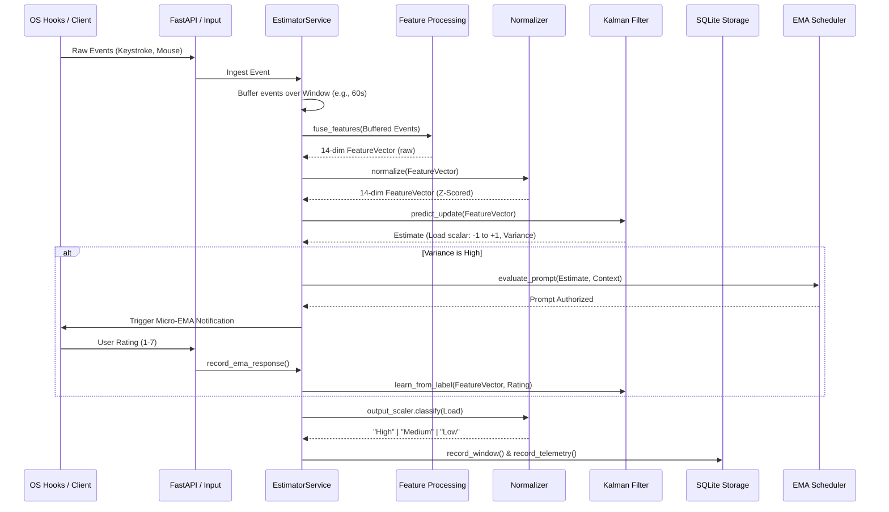

# Cognitive Load Estimator (CLE) Architecture & Data Pipeline

This document details the internal architecture, component interactions, data processing pipeline, and theoretical foundations of the Python Cognitive Load Estimator (`praboth-backend`).

---

## 1. Current Structure

The backend is structured into distinct, decoupled domains responsible for specific steps in the cognitive load inference lifecycle.

- **`backend/src/api/`**: Contains the FastAPI endpoints (`app.py`, `routers/`) for receiving events, polling state, and triggering actions.
- **`backend/src/core/`**: Core data models (`events.py`), configuration schemas (`config.py`), and foundational utilities.
- **`backend/src/data/`**: Storage layer orchestrator (`storage.py`) and granular SQLite repositories (e.g., `events`, `features`, `telemetry`).
- **`backend/src/services/`**: The heart of the application logic.
  - `service.py`: `EstimatorService` orchestrator that ties all components together over an event loop.
  - `kalman.py`: The Recusive Least Squares (RLS) adaptive Kalman Filter for state estimation.
  - `baseline.py`: Initial calibration logic.
  - `classifier.py` & `context.py`: LLM-backed categorization of the user's current activity (e.g., "collaboration", "writing").
  - `distraction/`: Tracks frequent context switching or idle periods.
  - `ema.py` & `ema_integrator.py`: Ecological Momentary Assessment (EMA) prompting logic.
  - `processing/`:
    - `features.py`: Aggregates raw keystroke/pointer paths into fixed-length vectors.
    - `normalization.py`: Personalizes data streams using rolling Huber statistics.
- **`backend/src/tools/`**: Included utilities such as `os_hooks.py` for global Windows event monitoring.

---

## 2. Component Interactions & Data Flow

### Sequence Diagram

### Component Inputs and Outputs

1. **`EstimatorService` (Orchestrator)**
   - **Input**: Raw `Event` streams (source, payload with latencies, timestamps).
   - **Output**: Orchestrates updates to storage and updates internal `latest_estimate` object.
2. **`ContextMonitor` & `ContextClassifier` (Context Awareness)**
   - **Input**: Active window/application name from OS hooks.
   - **Output**: Boolean `is_study` flag + category (e.g., "Writing", "Entertainment").
   - **Classification modes**: Simple (keyword matching) or LLM-backed (Genkit with SHA256 cache for privacy).
3. **`DistractionTracker` (Non-Study Detection)**
   - **Input**: `is_study` boolean, current app name, timestamps.
   - **Output**: `DistractionEvent` (start_time, end_time, app_name) when non-study period exceeds adaptive threshold.
   - **Adaptive Algorithm**: Learns user's micro-break patterns; threshold = Median(history) + 2×StdDev(history), clamped to [30s, 600s].
   - **Storage**: Records to `distraction_periods` SQLite table; queryable via `GET /distractions`.
4. **`Feature Processing` (`fuse_features`)**
   - **Input**: A window (e.g., 60s slice) of raw `Event` objects.
   - **Output**: A raw 14-dimensional `np.ndarray` containing aggregated metrics (e.g., IKI mean, Error Rate, Pointer Speed) + Quality score.
5. **`RollingNormalizer` (Input)**
   - **Input**: Raw 14-dim feature vector.
   - **Output**: Z-Scored 14-dim vector bounded by Huber clipping (e.g., `[-8.0, 8.0]`).
6. **`KalmanEstimator`**
   - **Input**: Normalized 14-dim vector + Observation weights.
   - **Output**: `Estimate` containing a scalar latent load (predicted cognitive state), variance (uncertainty), and residual.
7. **`OutputScaler` (Classification)**
   - **Input**: Scalar latent load (e.g., `0.45`).
   - **Output**: Categorical class (`"high"`, `"medium"`, `"low"`) based on relative deviation from the user's historical load mean.

---

## 3. Data to Cognitive Load Pipeline (With Examples)

Here is a step-by-step walkthrough of transforming raw signals into a cognitive state classification.

### Step 1: Raw Ingestion & Windowing

The service receives individual keystrokes and mouse movements. Over a 60-second window, it collects 40 keystrokes and 150 mouse trajectory updates.

- **Example Data**: `P` key (latency `120ms`), `R` key (latency `80ms`, backspace `False`), Mouse Move (dx: `5.2`, dy: `1.1`).

### Step 2: Feature Extraction (The Math)

The `fuse_features` function groups these raw events into statistics for the 14-dim vector.

- **Micro-pauses**: Calculates Log-Normal Mean of Inter-Key Intervals (IKI).
- **Pointer Stats**: Calculates total Euclidean distance per millisecond.
- **Example Output (Raw)**:  
  `[40.0, 4.2 (log IKI), 0.5 (std IKI), 0.1 (error rate) ... 15.2 (pointer speed), 0.0]`.

### Step 3: Input Normalization (Personalization)

Because User A types twice as fast as User B, raw features mean nothing globally. The `RollingNormalizer` maintains a rolling average specifically for this user.

- **Example Baseline**: The user's historical log IKI mean is `3.8`, with standard deviation `0.2`.
- **Normalization math**: `(4.2 - 3.8) / 0.2` = `2.0` Z-score. Current typing is significantly slower/pausier than _their_ normal.
- **Huber Clipping**: If they spilled coffee and paused for 60 seconds (Z-score 15), Huber clipping limits the vector update to `[..., 1.5, ...]` so outliers don't destroy their baseline.

### Step 4: Kalman Filtering (Latent State Estimation)

The Kalman filter takes the normalized 14-dim vector, multiplies it by learned RLS weights (which state how important "slower typing" is to load), and updates a continuous hidden state.

- **Prior State**: Cognitive load was `0.1` (slightly elevated) with high confidence.
- **Observation update**: Slower typing -> Predicted load calculation -> Yields new measurement of `0.6`.
- **Kalman Gain**: Matches prior confidence vs observation confidence. Yields new smoothed load.
- **Example Output**: New Load = `0.45` (Latent), Variance = `0.05`.

### Step 4b: Micro-EMA (Ecological Momentary Assessment)

If the Kalman filter loses confidence (variance gets too high), it triggers a Micro-EMA. The system asks the user "How is your cognitive load?" (1-7 scale).

- **Example Check**: Current variance `0.25` > Threshold `0.20`.
- **Action**: Assuming the user isn't in a meeting (Context check) and hasn't been asked recently (Cooldown check), the `EmaScheduler` triggers a prompt.
- **Feedback Loop**: User clicks "6" (High load). The system intercepts this, normalizes it, and sends it to `learn_from_label()`. The RLS weights are updated so the system _learns_ that the user's current behavioral pattern directly equals "High Load."

### Step 5: Output Scaling & Classification

Just as typing speeds differ, the resting "load state" number differs per user. The `OutputScaler` tracks the user's historical load scores.

- **Example Load History**: User's average load over the last hour is `0.2` with std dev `0.1`.
- **Classification math**: `(0.45 - 0.2) / 0.1` = `2.5` Z-score.
- **Result**: Because `2.5 > 1.0` threshold, the system flags `"high cognitive load"`.

---

## 4. Theoretical Backing & Existing Research

The steps defined above are not arbitrary; they synthesize proven techniques from HCI, robust statistics, and cognitive psychology.

### Keystroke Dynamics & Inter-Key Intervals (IKI)

- **Theoretical Backing**: Research indicates that typists organize motor output into "chunks". Smooth fast typing (Flow) indicates practiced recall, while longer IKIs reflect active problem-solving, hesitations, or lexical retrieval.
- **Research Foundation**:
  - _Goodbourn & Hind (2010)_: Demonstrated that cognitive load lengthens specific keystroke intervals during transcription tasks.
  - _Pinet et al. (2015)_: Inter-key intervals map to syllable boundaries and linguistic planning.
  - _Implementation in CLE_: Distinguishing between "micro" (<2s) and "macro" (>15s) pauses via Log-Normal statistics captures local planning vs. global task switching.

### Mouse Operations & Pointer Distance

- **Theoretical Backing**: Motor behavior degrades under mental stress. Users exert tighter grip on the mouse, resulting in rigid, less efficient trajectories (higher acceleration, fluctuating velocity).
- **Research Foundation**:
  - _Chen et al. (2001)_: Found that under varied difficulty, users generated more erratic pointer movements as task complexity increased.
  - _Implementation in CLE_: Euclidean distance over time (`pointer_speed`) and variance in that speed are utilized as negative correlates to relaxed states.

### Personalized Normalization (Huber)

- **Theoretical Backing**: Cross-user variance in hardware (trackpad vs. gaming mouse) and skill (hunt-and-peck vs touch typist) dwarf the within-subject variance of cognitive load. Global thresholds fail.
- **Research Foundation**:
  - _Huber (1964)_: Robust Estimation of a Location Parameter. Using an M-estimator (like Huber loss) prevents heavy-tailed anomaly events (e.g., getting a phone call while an app is tracking idle time) from dragging the mean.
  - _Implementation in CLE_: Rolling EMA with Huber clipping (`huber_delta=1.5`) allows the system to adjust to an individual's morning vs afternoon fatigue, while rejecting massive outliers.

### Recursive Least Squares & Kalman Filtering

- **Theoretical Backing**: Cognitive load is a "hidden" continuous variable. Our observations (typing speed) are extremely noisy. A Bayes filter optimally combines past beliefs with new, noisy data.
- **Research Foundation**:
  - _Kalman (1960)_: Linear filtering for discrete-data tracking.
  - _Simonov et al._: Utilizing adaptive filters on physiological parameters. The Recursive Least Squares (RLS) component continuously updates the mapping from observations to the target load state whenever an Ecological Momentary Assessment (EMA) (self-report) provides ground truth.

### Micro-EMA Active Learning

- **Theoretical Backing**: Continuous tracking models drift over time. Relying purely on unsupervised rules (like "fast typing = low load") fails to account for task difficulty. Collecting self-reported labels interactively "re-grounds" the model, but interrupting the user destroys their workflow.
- **Research Foundation**:
  - _Intille et al. (2016)_: Demonstrated that micro-interactions (under 4 seconds) on smartwatches function effectively as EMAs with minimal disruption to the primary task.
  - _Implementation in CLE_: "Uncertainty Sampling" is used. The `KalmanEstimator` naturally outputs a `variance` (uncertainty parameter). The `EmaScheduler` monitors this parameter, and only triggers a disruption when the mathematical uncertainty exceeds a threshold, keeping the user burden to an absolute minimum while maximizing model accuracy.

---

## 5. Additional Features & Usage

Beyond the core inference pipeline, several peripheral features ensure the system is practical, privacy-respecting, and context-aware.

### Context Classification (`classifier.py` & `context.py`)

- **Usage**: Automatically categorizes the user's active application window into broader contexts (e.g., "Collaboration", "Analysis", "Writing").
- **Implementation**: Monitors OS-level window titles. Can utilize lightweight heuristics or an LLM-backed classification to assign a label.
- **Impact**: Used by the EMA Scheduler to prevent prompting the user during high-stakes activities (like a Zoom meeting) or when they are actively presenting.

### Distraction & Idle Tracking (`distraction/`)

- **Usage**: Tracks the frequency of context switches and periods of absolute inactivity.
- **Implementation**: The `DistractionTracker` computes a penalty if the user jumps between 5 different applications in 30 seconds.
- **Impact**: High distraction can artificially inflate typing intervals. Tracking this allows the system to flag periods of scattered attention, preventing the model from incorrectly assuming the user is in a state of high, focused cognitive load.

### Privacy & Permission Guard (`policy.py` & `events.py`)

- **Usage**: Acts as a strict firewall between the OS event hooks and the backend processor.
- **Implementation**: The `PermissionGuard` checks an explicit blocklist (e.g., banking apps, password managers) and idle timeouts (e.g., 600 seconds).
- **Impact**: If a blocked app is focused, or the user walks away from the keyboard, the guard drops all raw payloads immediately, logging only that tracking was "paused" for privacy/idle reasons. No raw keystroke data is _ever_ persisted to disk.

---

## 6. Fulfillment of System Requirements

The architecture explicitly targets standard software engineering system requirements for local heuristic systems.

### Functional Requirements

- **Real-time Ingestion & Fusion**: Satisfied by the asynchronous `EstimatorService` loop and `EventBuffer` which non-blockingly aggregates live event streams into fixed-length windows (e.g., 60s ticks).
- **Personalized Tracking**: Satisfied by the `RollingNormalizer`. The system adapts to the user rather than forcing the user to map to an arbitrary global scale.
- **Adaptive Ground Truth Prompting**: Satisfied by the `KalmanEstimator` and `EmaScheduler` working in tandem. The system only disrupts the user (Micro-EMA) when mathematically uncertain (`variance > threshold`), minimizing prompt fatigue.

### Non-Functional Requirements

- **Performance & Efficiency (Low CPU Footprint)**:
  - The feature vector dimension is small (14).
  - The Kalman Filter and Recursive Least Squares (RLS) use vectorized `numpy` operations.
  - No deep learning or heavy PyTorch models are run constantly. The service is designed to run silently in the background of a standard laptop without draining battery.
- **Privacy & Data Sovereignty**:
  - **Local First**: All event processing, modeling, and data storage happens locally in a SQLite database (`yuvindu_data.db`).
  - **No Raw Logging**: The `fuse_features` pipeline turns raw latencies into aggregate statistics (means, std devs) in memory. The raw payload (`P` key pressed) is discarded. Only the mathematical vector is saved.
- **Reliability & Warm-Starting**:
  - The `Storage` layer periodically flushes the user's Kalman filter state, RLS weights, and Normalization matrices to disk.
  - If the machine reboots, `EstimatorService` automatically restores these states (`load_latest_model_state()`), ensuring the personalized model doesn't suffer from "amnesia" on every launch.
