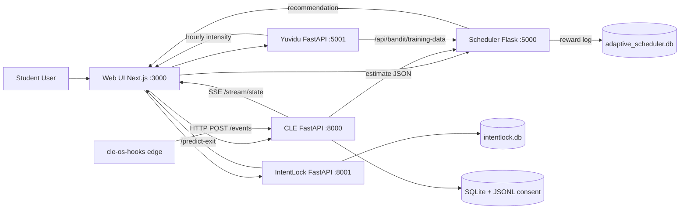

# 2 Methodology

## 2.1 Overall Research Design

This dissertation follows a **mixed-methods engineering research design** with staged implementation and comparative validation:

- **Design science** for building and integrating four cooperating software subsystems (`praboth/`, `older/`, `yuvidu/`, `newer/andrew/`) under a shared deployment plan.
- **Quantitative evaluation** for predictive, policy, and behavioural metrics computed by the eight-metric harness in `older/src/metrics/metrics_calculator.py` and the in-tree evaluators in `newer/andrew/intentlock-backend/evaluate_model.py` and `praboth/backend/src/tests/`.
- **Qualitative evaluation** for trust, usability, and perceived burden using NASA-TLX [@nasatlx1986] alongside semi-structured exit interviews.

The implementation is modular and service-oriented, allowing each subsystem to evolve independently while sharing common session and user contexts via the SQLite-backed `adaptive_scheduler.db` (scheduler) and `intentlock.db` (Intent-Lock) and the SQLite store maintained inside `praboth/`.

### 2.1.1 Study Phases

The method is organised into four execution phases aligned with the four individual proposals:

1. **Architecture and prototype implementation** of all four modules (already realised in this repository).
2. **Offline simulation and synthetic testing** for algorithm sanity and cold-start behaviour. Examples include `older/generate_test_data.py`, `older/simulate_work.py`, and the synthetic data generator in `newer/andrew/intentlock-backend/data/synthetic_data_generator.py`.
3. **Pilot deployment** with small user groups (5–10 participants) for usability and calibration.
4. **Comparative evaluation** against fixed and random baselines in larger controlled sessions (20–30 participants) using the eight-metric harness.

### 2.1.2 Mixed-Methods Rationale

Quantitative-only validation would not sufficiently capture intrusiveness and user trust, while qualitative-only feedback would not validate algorithmic adaptation quality. Therefore, the project combines:

- statistical metrics (Pearson correlation, MAE, reward, regret-per-hour, adaptation half-life),
- behavioural metrics (session continuity, impulsive-exit rate, friction-level distribution),
- user-reported workload and acceptance indicators using NASA-TLX, perceived intrusiveness, and Likert acceptance items.

## 2.2 System Architecture

The integrated architecture is shown in Figure 2.1. Edge capture occurs on the user's machine; the four backend services and the Next.js UI run as cooperating containers per the project deployment strategy [@deploymentdoc2025].



**Figure 2.1 — Integrated runtime architecture.** Solid arrows denote HTTP request/response calls; the labelled SSE arrow denotes a Server-Sent Events stream from CLE to the Next.js UI. The edge OS-hooks client is a Python `pynput` + `SetWinEventHook` process packaged as the `cle-os-hooks` console script (`praboth/backend/src/tools/os_hooks.py`); it talks to the CLE over HTTP only, never WebSocket.

The architecture supports a **hybrid edge-cloud deployment**. OS-level events are captured at the edge, while APIs and UI can be containerised in centralised infrastructure. Concretely, the deployment artefacts at `25-26J-458-Students/6. CheckList Documents/CheckList set 3/Deployment Strategy Document .pdf` describe a Docker-Compose MVP with an Nginx or Traefik reverse proxy, migrating to Kubernetes with horizontal pod autoscalers in production, with managed PostgreSQL (or AWS RDS) replacing the local SQLite stores and persistent volumes for state survival across container restarts [@deploymentdoc2025].

### 2.2.1 Data and Control Flows

The primary runtime flow is:

1. The OS-hooks edge agent captures keyboard latency events, pointer deltas, and Windows foreground events (via `SetWinEventHook`), and posts them to `POST /events` on the CLE service.
2. CLE windows the events at 60 s width and 15 s hop, builds the 14-dimensional feature vector, normalises with a Huber-clipped EWMA, and runs a scalar Kalman + RLS update to produce `load`, `variance`, `ci95`, `residual`, and `quality` (`praboth/backend/src/services/processing/features.py`, `kalman.py`).
3. The Next.js UI subscribes to `GET /stream/state` (SSE) for live load + telemetry; it also polls `GET /estimate` and posts EMA responses to `POST /ema/response`.
4. When the user starts a study session, the UI calls `POST /api/start-session` (or `POST /api/time-block/start`) on the scheduler, which selects an action via LinUCB or Thompson Sampling using the 8-D context derived from typing dynamics and the CLE-fused load.
5. On exit attempts, the UI sends `(session_minutes, latent_mean)` to `POST /predict-exit` on Intent-Lock; the response includes the predicted class, the friction level, and the message text. Reflection answers are logged via `POST /log-reason`.
6. The chronotype service exposes `GET /predictall`, `GET /weekly-predictions`, `GET /hourly-intensity`, `GET /next-best-study-window`, and `GET /insights` for time-of-day recommendation and visualisation. Training data is pulled via `GET /api/bandit/training-data` from the scheduler when available, or from local CSV otherwise (`yuvidu/backend/real_data_loader.py`).

This loop enables both short-term adaptation (within session) and long-term adaptation (across sessions and weeks).

## 2.3 Subsystem Methodologies

### 2.3.1 Cognitive Load Estimator (CLE) — `praboth/`

#### 2.3.1.1 Pipeline Overview

The CLE pipeline implemented in `praboth/backend/src/services/` and described in `praboth/cle_architecture.md` consists of five stages:

1. **Event capture and filtering.** Raw keyboard and pointer events arrive at `POST /events` (`praboth/backend/src/api/app.py`). The capture client (`praboth/backend/src/tools/os_hooks.py`) records keystroke latency only — never the typed character or text — pointer deltas, and Windows foreground events including a heuristic `context_label`.
2. **Windowing.** A `WindowManager` partitions events into rolling 60-second windows with 15-second hop (`window_seconds = 60`, `hop_seconds = 15`, `inactivity_gap_seconds = 5`; see `praboth/backend/src/core/config.py`).
3. **Feature extraction.** Each window produces a 14-dimensional vector, defined below.
4. **Normalisation.** A `RollingNormalizer` applies an exponentially-weighted update with Huber-clipped deltas (`huber_delta = 1.5`, default `min_std`, clip absolute z-score at 8.0) before the Kalman observation step.
5. **State estimation and EMA gating.** A scalar Kalman filter with RLS-adapted observation weights produces `(load, variance, residual, quality)`; the `EmaScheduler` triggers a micro-EMA prompt when current variance exceeds the 90th percentile of the rolling variance history, gated by macro-pause / focus-switch breakpoints.

This is materially different from the proposal's earlier framing of a pure Kalman filter or a simple residual-threshold prompter; the implementation is specifically *percentile-based* on variance.

#### 2.3.1.2 Feature Engineering Detail

`FEATURE_VECTOR_DIM = 14` (`praboth/backend/src/services/processing/features.py`). Features are concatenated in the order *keyboard (7) → pointer (4) → context (3)*:

**Table 2.1 — CLE 14-dimensional feature vector.**

| # | Group | Feature | Description |
|---|---|---|---|
| 1 | Keyboard | `keystrokes` | Count of keyboard events in the window |
| 2 | Keyboard | `iki_log_mean` | Log-mean of inter-key intervals (seconds) |
| 3 | Keyboard | `iki_log_std` | Log-std of inter-key intervals |
| 4 | Keyboard | `micro_pause_rate` | Rate of pauses in [2 s, 15 s) (default thresholds) |
| 5 | Keyboard | `macro_pause_rate` | Rate of pauses ≥ 15 s |
| 6 | Keyboard | `error_rate` | `is_error` flagged keystrokes / count |
| 7 | Keyboard | `backspace_rate` | Backspace key (VK 8) rate |
| 8 | Pointer | `pointer_events` | Count of pointer events |
| 9 | Pointer | `pointer_speed_mean` | Mean speed `sqrt(dx²+dy²)/dt` |
| 10 | Pointer | `pointer_speed_std` | Std of speed |
| 11 | Pointer | `pointer_accel_mean` | First difference of speed |
| 12 | Context | `locked_ratio` | Fraction of time the workstation was locked |
| 13 | Context | `dnd_ratio` | Fraction of time Do-Not-Disturb was active |
| 14 | Context | `avg_idle_seconds` | Mean of `idle_seconds` (from `GetLastInputInfo`) |

If a window has no keyboard or no pointer events, `fuse_features` carries forward the corresponding subrange of the previous vector and sets `keyboard_imputed` or `pointer_imputed` flags so downstream consumers can reason about imputation. Outlier handling uses Huber-style robust clipping in the rolling normaliser to reduce sensitivity to interruptions and device differences [@huber1964].

#### 2.3.1.3 State Estimation Strategy

The estimator treats cognitive load as a latent variable inferred from noisy observations. The scalar Kalman filter follows the standard predict/update form [@kalman1960]:

- predict: `x_t|t-1 = x_t-1`, `P_t|t-1 = P_t-1 + Q`
- observe: `z_t = w_tᵀ φ_t + n_t` with `n_t ~ N(0, R/q_t)` where `q_t` is the per-window quality factor and `R = 0.05`
- update: `K_t = P_t|t-1 / (P_t|t-1 + R/q_t)`, `x_t = x_t|t-1 + K_t (z_t − x_t|t-1)`, `P_t = (1 − K_t) P_t|t-1`

The observation weights `w_t` are adapted via RLS with forgetting factor `λ = 0.98` whenever a labelled micro-EMA value is available (`praboth/backend/src/services/kalman.py`). Configuration defaults are: `process_noise = 0.01`, `measurement_noise = 0.05`, `rls_initial_covariance = 10.0`, `state_clip = 10.0`, `diffuse_variance = 4.0`, `baseline_minutes = 5`, `baseline_target_variance = 0.3`. This is chosen over a discriminative classifier because:

- it supports online sequential updates,
- it explicitly tracks uncertainty (`variance`) which is then used for EMA gating,
- it supports active prompting policies triggered by confidence decay.

#### 2.3.1.4 Privacy and Policy Guardrails

The module enforces content-safe collection (`praboth/backend/src/services/policy.py` and the corresponding API in `app.py`):

- no raw typed strings are persisted; only event timing and aggregate counts are stored,
- a `PolicyActor` suppresses prompts when (a) `privacy_pause` is set via `POST /privacy`, (b) `consent_granted=False` via `POST /consent`, (c) the workstation has been idle longer than `idle_block_seconds`, (d) the current `context_label` is on the `context_blocklist`, or (e) Do-Not-Disturb is active,
- a 48-hour retention policy is enforced by `prune_retention()` (`StorageConfig.retention_hours = 48` by default),
- structured `consent_log.jsonl` and `policy_events` provide an audit trail,
- a reviewed `POST /export/request` workflow allows aggregate data export only after explicit approval.

### 2.3.2 Adaptive Break Scheduler — `older/`

#### 2.3.2.1 Decision Model

The scheduler models each recommendation as a contextual decision with the following ingredients (see `older/src/bandit_engine/`, `older/config/config.py`):

- **Action space (16 arms).** All pairs `(W ∈ {20, 30, 45, 60} min, B ∈ {3, 5, 8, 12} min)`. Both arrays are configured as `WORK_INTERVALS` and `BREAK_DURATIONS` in `older/config/config.py`.
- **Context (8-D).** Built by `ContextFeatures.to_vector()` in `older/src/feature_extractor/feature_extractor.py`: `[mean_iki, std_iki, typing_speed, correction_ratio, pause_count, session_duration, time_of_day, cognitive_load]`. `time_of_day` is encoded as 0 morning / 1 afternoon / 2 evening, and `cognitive_load ∈ [0, 1]` is sourced from CLE via `older/src/data_integration/praboth_metrics_adapter.py`.
- **Reward.** Composed by `RewardCalculator` (`older/src/reward_handler/reward_calculator.py`).

#### 2.3.2.2 Bandit Algorithms

Two bandit algorithms are implemented:

- **LinUCB** (`older/src/bandit_engine/linucb.py`) maintains per-arm `A` and `b` such that `θ = A⁻¹ b`, and selects the arm maximising `θᵀx + α √(xᵀA⁻¹x)`. Updates are `A ← A + xxᵀ` and `b ← b + r x`. A pseudo-inverse fallback is used if `A` becomes singular.
- **Thompson Sampling** (`older/src/bandit_engine/thompson_sampling.py`) maintains per-arm Gaussian posteriors over `θ` with mean `μ` and covariance `Σ`. Updates are `Σ⁻¹_new = Σ⁻¹_old + xxᵀ/σ²`, `μ_new = Σ_new (Σ⁻¹_old μ_old + r x / σ²)`. At decision time it samples `θ̃ ~ N(μ, Σ)` and selects `argmax_a θ̃ᵀ x`.

The `AdaptiveScheduler` (`older/src/bandit_engine/adaptive_scheduler.py`) wraps both with `SafetyConstraints` from `safety_constraints.py` so abrupt policy shifts are damped and arm choices remain inside reasonable study norms; user override events are logged as negative-feedback signals via `actions.was_overridden`.

#### 2.3.2.3 Reward Formulation

The `RewardCalculator.calculate_immediate_reward` produces

`R_t = w_1 · R_{progress,t} + w_2 · R_{relief,t}` shaped by EMA-quality, deep-work-interrupt, and CLE-quality bonuses, then clipped to `[-1, 1]`. The default weights are `w_1 = 0.6` and `w_2 = 0.4` (not the abstract `α/(1-α)` of the proposal). When delayed reward is available, the final reward is `0.7 · immediate + 0.3 · delayed` (constants `IMMEDIATE_REWARD_WEIGHT`, `DELAYED_REWARD_WEIGHT` in `older/config/config.py`).

- **Progress utility `R_{progress}`.** Combines typing speed, focus-from-keystroke-gaps, and a completion proxy when typing telemetry is unavailable.
- **Relief utility `R_{relief}`.** Derived from pre-/post-break cognitive-load delta via `1 − exp(−2.5 · Δload)`; a duration heuristic is used when post-load is missing.

#### 2.3.2.4 Evaluation Metrics

Beyond cumulative reward and regret, the module ships an eight-metric harness in `older/src/metrics/metrics_calculator.py`. All metrics are persisted to the `metrics` SQL table by `save_metrics_to_db`.

**Table 2.2 — Implemented evaluation metrics for the scheduler.**

| Metric | Method | Interpretation |
|---|---|---|
| **PG** — Personalisation Gain | `compute_personalization_gain` | Reward improvement vs cohort-mean baseline |
| **RPH** — Regret-per-Hour | `compute_regret_per_hour` | `(1/H) Σ (r* − r)` with `r*` from the in-hindsight oracle |
| **AHL** — Adaptation Half-Life | `compute_adaptation_half_life` | Sessions to halve residual error after a context shift |
| **EOI** — Exploration Overhead Index | `compute_exploration_overhead_index` | Excess regret due to exploration over the optimal-arm policy |
| **BUC / AUC-BUC** — Break Utility Curve | `compute_auc_buc` | Per-break-length utility curve; trapezoidal AUC over `BREAK_DURATIONS` |
| **CTU** — Counterfactual Targeting Uplift | `compute_counterfactual_targeting_uplift` | Simplified IPS-style uplift relative to non-targeted policy |
| **SPF-Var** — Stability–Productivity Frontier variance | `compute_spf_variance` | Reward variance as a stability indicator |
| **SVR** — Safety Violation Rate | `compute_safety_violation_rate` | Fraction of actions blocked by safety constraints |

#### 2.3.2.5 API Surface

The scheduler exposes (`older/src/api/app.py`, `older/src/api/metrics_endpoint.py`):

- session lifecycle: `POST /api/start-session`, `POST /api/end-interval`, `POST /api/end-session`, `POST /api/submit-feedback`,
- recommendations: `GET /api/get-recommendation`,
- the production-style time-block flow used by the Intent-Lock UI: `POST /api/time-block/start`, `GET /api/time-block/current`, `GET /api/time-block/recommendation`, `GET /api/time-block/suggestion`, `POST /api/time-block/pause`, `POST /api/time-block/resume`, `POST /api/time-block/end-interval`, `POST /api/time-block/end`,
- analytics: `GET /api/metrics`, `GET /api/metrics/detailed`, `GET /api/bandit/training-data`,
- observability: `GET /api/health`, `GET /` (discovery).

Note that the proposal's abstract `/recommend`/`/feedback` route names are not present in the implementation; the canonical names are `/api/get-recommendation` and `/api/submit-feedback`.

### 2.3.3 Chronotype-aware Time-of-Day Recommender — `yuvidu/`

The repository contains both `yuvidu/` (root, canonical) and `newer/yuvidu/` (legacy Next.js app); per `yuvidu/OLD-VS-NEW-YUVIDU.md` the root tree is the maintained app and runs on port 5001. The legacy tree is preserved for reference but not used for evaluation.

#### 2.3.3.1 Modelling Approach

Although the literature [@zerbini2017; @goldin2017] motivates per-user chronotype priors, the implementation realises chronotype operationally through:

- four **time-of-day arms** (`morning`, `afternoon`, `evening`, `night`) over which a `mabwiser` LinUCB policy with `alpha = 1.25` is trained (`yuvidu/backend/bandit_model.py`), and
- a context vector that includes `sleep_hours_prev_night` along with behavioural features such as `block_focus`, `keystroke_intervals_mean`, `burstiness`, `scroll_rate`, `idle_time_percent`, and `microEMA` aggregates.

Predictions are made on the *average* context for the user; expected rewards per arm are normalised to a percentage distribution over the four arms (`predict_all_percentages`).

#### 2.3.3.2 Weekly Hybrid Path

For the weekly view, a `GradientBoostingRegressor` is trained on `(context + day-one-hot) → reward`. At inference time, the per-day prediction combines the bandit's expected reward with hand-tuned weekend/weekday multipliers (e.g. weekend morning/afternoon bonus, weekday night penalty) to produce per-day best-time recommendations rendered as `WeeklyPredictions.tsx` day cards. This is not a Gaussian or triangular kernel over `(hour, day)` — it is a piecewise multiplier scheme — and the dissertation describes it accordingly to avoid overclaiming.

#### 2.3.3.3 Visualisation

The "heatmap" component (`yuvidu/frontend/src/ui/components/Heatmap.tsx`) renders a single 24-hour intensity ribbon, not a (hour × day) matrix. Each cell receives:

- the hourly percentage from `GET /hourly-intensity` (sessions involving that hour, optionally scoped by `user_id` via `yuvidu/backend/user_sessions.py`), or
- a flat fill from `GET /predictall`'s morning/afternoon/evening/night percentages when hourly data is absent.

The next-best-window card (`StudyWindow.tsx`) consumes `GET /next-best-study-window`, and the insights card (`Insights.tsx`) consumes `GET /insights`.

#### 2.3.3.4 API Surface

The chronotype service exposes:

- `GET /` — health/banner,
- `GET /predict` — best arm string,
- `GET /predictall` — `{best_time, percentages, status}`,
- `GET /weekly-predictions` — ML-based weekly view (`predict_weekly_windows_ml`),
- `GET /weekly-predictionss` — non-ML weekly view (typo route, kept for backward compatibility),
- `GET /hourly-intensity` (optional `?user_id=…`),
- `GET /next-best-study-window`,
- `GET /insights`.

The proposal-style `/heatmap`, `/recommend-time`, `/feedback`, and `/chronotype-survey` endpoints are *not* implemented; a Morningness–Eveningness Questionnaire (MEQ) survey is described as **designed but not yet implemented** and is documented in §4.3.

### 2.3.4 Intent-Lock Overlay — `newer/andrew/`

#### 2.3.4.1 Decision Model

The Intent-Lock backend (`newer/andrew/intentlock-backend/main.py`, FastAPI on port 8001) classifies a `(session_minutes, latent_mean)` pair as `impulsive` or `genuine` using a single `LogisticRegression(max_iter=1000, random_state=42)` (`models/model.py`). The model is loaded from `models/intent_model.joblib` on startup; if the artefact is missing and the `synthetic_training_data` table is non-empty, the model is trained at boot.

#### 2.3.4.2 Synthetic Training Data

Bootstrap data is generated by `data/synthetic_data_generator.py` (default `n = 500`), with:

- **session length** drawn from a piecewise uniform distribution: 40% short `U(5, 30)`, 40% medium `U(30, 60)`, 20% long `U(60, 120)`,
- **cognitive load** drawn from `Beta(2, 3)` (mean ≈ 0.4, slightly left-skewed),
- labels assigned by rule: high cognitive load (>0.7) → impulsive with high probability; low cognitive load (<0.3) → genuine; with probabilistic mixing in the middle band, also influenced by short (<25 min) vs long (>45 min) session length.

The rules and distributions match the project's `RESEARCH_BACKING.md` and provide a Cognitive-Load-Theory-grounded prior over which the LR coefficients are learned.

#### 2.3.4.3 Friction Ladder

The friction ladder is integer-valued `friction_level ∈ {0, 1, 2}`, decided in `main.py` after the LR prediction:

- **Level 0 — gentle prompt.** "You've been focused. Are you sure you want to exit?" Continue Studying / Exit Anyway.
- **Level 1 — reason capture.** "Before exiting, please tell us why:" — a reason dropdown plus optional notes; submitted via `POST /log-reason`.
- **Level 2 — confirmation + countdown.** "You've attempted to exit multiple times. Please confirm your intent." A 3-second countdown precedes the actual exit.

The level is selected by `count_impulsive_exits(session_id)`: 0 → 0, 1 → 1, ≥2 → 2. Note that `insert_exit_event` runs *before* the response, so the current attempt is counted; the dissertation describes the ladder as escalation *given previously logged impulsive attempts at the same `session_id`*.

`IntentLockModal.tsx` is the live overlay used by `intentlock-frontend/app/page.tsx`. A second, more inline-styled component (`IntentLockOverlay.tsx`) is present in the repository but is not currently mounted by the application.

#### 2.3.4.4 Database and Reflection Logging

The Intent-Lock SQLite schema (`data/database.py`) has three tables:

- `synthetic_training_data` `(session_minutes REAL, latent_mean REAL, label INTEGER)`,
- `exit_events` `(timestamp, session_minutes, latent_mean, prediction, friction_level, allowed_exit, session_id)`,
- `exit_reasons` `(exit_event_id FK, reason, custom_text)` — populated by `POST /log-reason` for level-1 escalations.

There is currently no separate `sessions` table and no automatic retention/pruning; both are listed as future-work items in §4.

#### 2.3.4.5 API Surface

The implemented endpoints are:

- `GET /` — banner,
- `GET /health`,
- `POST /predict-exit` — `{session_minutes, latent_mean, session_id}` → `{prediction, friction_level, message, exit_event_id, requires_friction}`,
- `POST /log-reason` — `{exit_event_id, reason, custom_text?}` → `{status, message}`.

The proposal-style `/intent/predict`, `/intent/exit-event`, and `/intent/reason` route names are not implemented; the canonical names above are used. The proposal's Decision Tree alternative classifier is **designed but not yet implemented** (see §4.3). The proposal's "OS-wide application-switch interception" is similarly out of scope for the current build, which intercepts exits at the in-app session-end level.

### 2.3.5 Implementation Stack and Service Interfaces

**Table 2.3 — Implementation stack.**

| Layer | Stack | Repository path |
|---|---|---|
| Frontend (CLE) | Next.js + React + SSE | `praboth/frontend/` |
| Frontend (Scheduler dashboard) | HTML + JS | `older/static/dashboard.html` |
| Frontend (Intent-Lock + integrated UI) | Next.js + React | `newer/andrew/intentlock-frontend/` |
| Frontend (Yuvidu) | Vite + React (+ optional Electron) | `yuvidu/frontend/` |
| CLE API | FastAPI, Python 3.11 | `praboth/backend/src/api/` |
| Scheduler API | Flask, Python 3.11 | `older/src/api/` |
| Yuvidu API | FastAPI, Python 3.11 | `yuvidu/backend/server.py` |
| Intent-Lock Backend | FastAPI + scikit-learn `LogisticRegression` | `newer/andrew/intentlock-backend/` |
| Bandit libraries | NumPy (LinUCB, Thompson, custom) and `mabwiser` | `older/src/bandit_engine/`, `yuvidu/backend/bandit_model.py` |
| Storage | SQLite per-service (extensible to PostgreSQL or AWS RDS) | repository-local `.db` files |
| Edge agent | Python `pynput` + `SetWinEventHook` packaged as `cle-os-hooks` | `praboth/backend/src/tools/os_hooks.py` |
| Deployment | Docker Compose (MVP) → Kubernetes (scale phase) | `25-26J-458-Students/6. CheckList Documents/CheckList set 3/Deployment Strategy Document .pdf` |

This contract-first approach enables module decoupling and incremental deployment.

## 2.4 Data Collection Strategy

### 2.4.1 Passive features

- Inter-key intervals and pause statistics (micro-pause `[2, 15)` s, macro-pause ≥15 s),
- backspace and error rates,
- pointer speed mean/std/acceleration,
- session duration and timing metadata,
- foreground-application context labels (heuristic class, never the window title text in storage).

### 2.4.2 Active labels

Micro-EMA prompts capture perceived fatigue/focus on a 1–7 Likert scale (`PromptPanel.tsx`). Prompt scheduling follows cooldown (`min_seconds_between_prompts = 1800`), uncertainty (90th-percentile variance) and breakpoint (macro pause / focus switch) logic so users are not interrupted during high-intensity interaction bursts. Awaiting-response and snooze states are tracked (`praboth/backend/src/services/ema.py`).

### 2.4.3 Safety and privacy

- No raw text storage,
- local-first processing where possible,
- explicit user consent and transparency controls in UI (`POST /privacy`, `POST /consent`, `GET /permissions`, blocklist editor),
- 48-hour retention on raw event tables with reviewed export workflow.

### 2.4.4 Data Quality and Preprocessing

- Outlier filtering for extreme inactivity intervals,
- rolling normalisation for user-specific baselines,
- timestamp alignment across services,
- imputation flags for empty-keyboard or empty-pointer windows,
- anonymised export format for analysis.

## 2.5 Service Interfaces (Reference)

Core API contracts (illustrative subset):

```http
POST /events                         # CLE: ingest edge events
GET  /estimate                       # CLE: latest estimate
GET  /stream/state                   # CLE: SSE telemetry + estimate
POST /ema/response                   # CLE: micro-EMA response
POST /privacy                        # CLE: privacy pause toggle
POST /consent                        # CLE: consent toggle
POST /export/request                 # CLE: aggregate export request

POST /api/start-session              # Scheduler: begin session
GET  /api/get-recommendation         # Scheduler: bandit action
POST /api/end-interval               # Scheduler: reward and next action
POST /api/submit-feedback            # Scheduler: micro-EMA forwarding
POST /api/time-block/*               # Scheduler: production time-block flow

POST /predict-exit                   # Intent-Lock: classify exit attempt
POST /log-reason                     # Intent-Lock: reflective reason

GET  /predictall                     # Yuvidu: 4-arm percentages
GET  /weekly-predictions             # Yuvidu: 7-day weekly hybrid
GET  /hourly-intensity               # Yuvidu: 24-hour ribbon
GET  /next-best-study-window         # Yuvidu: next 4-hour window
GET  /insights                       # Yuvidu: textual insights
```

The full inventory is given in Appendix D.

## 2.6 Testing and Validation

### 2.6.1 Implemented Tests

- **CLE.** `praboth/backend/src/tests/test_kalman.py`, `test_normalization.py`, `test_features_pause.py`, `test_ema.py`, `test_ema_logic.py`, `test_window_manager.py`, `test_distraction.py`, `manual_check.py`, and the legacy `praboth/tests/test_app_api.py`, `test_pipeline.py`, `test_features_vector.py`, `test_benchmarks.py`.
- **Scheduler.** `older/tests/test_bandit.py`, `test_reward.py`, `test_praboth_integration.py`; root-level `test_reward_calculator_unit.py`, `test_integration.py`, `test_reward_quick.py`; demo harnesses `older/demo_progress.py`, `run_workflow.py`, `generate_test_data.py`, `simulate_work.py`, `monitor_events.py`.
- **Intent-Lock.** `newer/andrew/intentlock-backend/evaluate_model.py` (training-set accuracy, per-class accuracy, confusion matrix, precision/recall/F1) and `test_model.py` (manual smoke tests).
- **Yuvidu.** No automated tests are present in `yuvidu/` or `newer/yuvidu/` at this time; this absence is flagged as a validity threat in §3.5.

### 2.6.2 Experimental Groups

- **Group A** — Adaptive scheduler + full integrated support (CLE + Scheduler + Yuvidu + Intent-Lock).
- **Group B** — Fixed Pomodoro baseline (25 min / 5 min, no friction).
- **Group C** — Random interval baseline (uniform draw from the same `(W, B)` set, no friction).

### 2.6.3 Outcome Measures

- **Objective.** Completion trends, error dynamics, adaptation speed, AHL, RPH, EOI, AUC-BUC, CTU, SPF-Var, SVR, exit-classifier accuracy / F1.
- **Subjective.** NASA-TLX [@nasatlx1986], perceived focus, trust, perceived intrusiveness.
- **Behavioural.** Exit-attempt reduction, confirmation latency, session continuity, distribution of friction levels.

### 2.6.4 Statistical Analysis Plan

- ANOVA across experimental groups for key outcome differences,
- paired t-tests for pre/post within-user changes,
- Pearson correlation between estimated load and self-reported workload,
- Kaplan–Meier-style survival analysis for time-to-fatigue.

### 2.6.5 Validity Controls

- 5-minute calibration windows before full comparison (CLE `baseline_minutes = 5`),
- explicit logging of missing-response intervals,
- consistent measurement windows across groups,
- sensitivity checks by chronotype subgroup,
- sealed random seed for synthetic data (`random_state = 42`) for reproducibility of LR training.

## 2.7 Commercialisation Aspects

The platform can be commercialised as:

- a direct-to-user productivity application (freemium),
- a software development kit (SDK) for third-party educational apps,
- institutional licensing for schools and universities.

### 2.7.1 Revenue and Adoption Pathways

- freemium personal tier with premium analytics (chronotype + multi-week metrics),
- campus licensing with dashboard / reporting add-ons,
- API/SDK partnerships with existing EdTech products.

### 2.7.2 Deployment Strategy for Scale

As documented in `25-26J-458-Students/6. CheckList Documents/CheckList set 3/Deployment Strategy Document .pdf` [@deploymentdoc2025], the recommended progression is:

1. Docker Compose single-host deployment for MVP pilots, with Nginx or Traefik handling reverse-proxy routing across the four service ports.
2. Kubernetes migration for independent service scaling with Horizontal Pod Autoscalers; ML-heavy services (Intent-Lock LR inference, Yuvidu LinUCB, CLE) are scaled separately from the Next.js UI.
3. Managed storage replacement for the per-service SQLite stores: AWS RDS (PostgreSQL) for transactional data, persistent volumes for state survival across container restarts, optional Redis for hot caches.
4. The edge `cle-os-hooks` agent is distributed as a standalone lightweight installer with an auto-updater path, since OS-level keystroke and pointer event capture cannot run in cloud containers.

## 2.8 Ethical and Governance Considerations

- Informed consent before event collection, including a one-time onboarding flow.
- Transparent disclosure of collected metadata categories (timing, counts, context labels — never typed text).
- User control for `POST /privacy` pause, `POST /consent` toggle, blocklist editing, and per-context idle-window disable.
- Secure local storage defaults (SQLite with restricted file permissions) and controlled cloud transfer policies under a reviewer-approved export workflow.
- Anonymised export for any external aggregate analysis.

## 2.9 Chapter Summary

This chapter described the full technical and experimental methodology for all four project modules and their integration, anchored at every step on concrete code locations within `praboth/`, `older/`, `yuvidu/`, and `newer/andrew/`. The next chapter presents synthesised expected and observed results, findings, and student-level contribution mapping.
