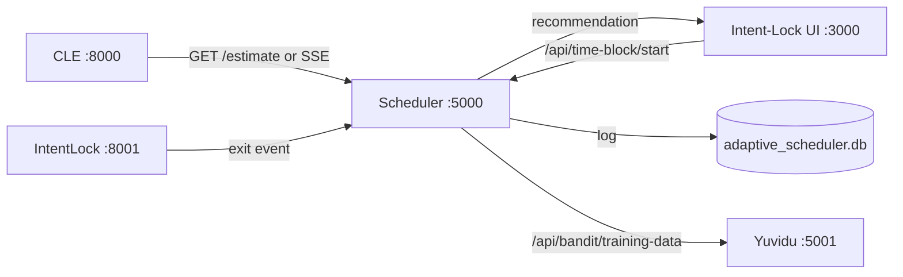
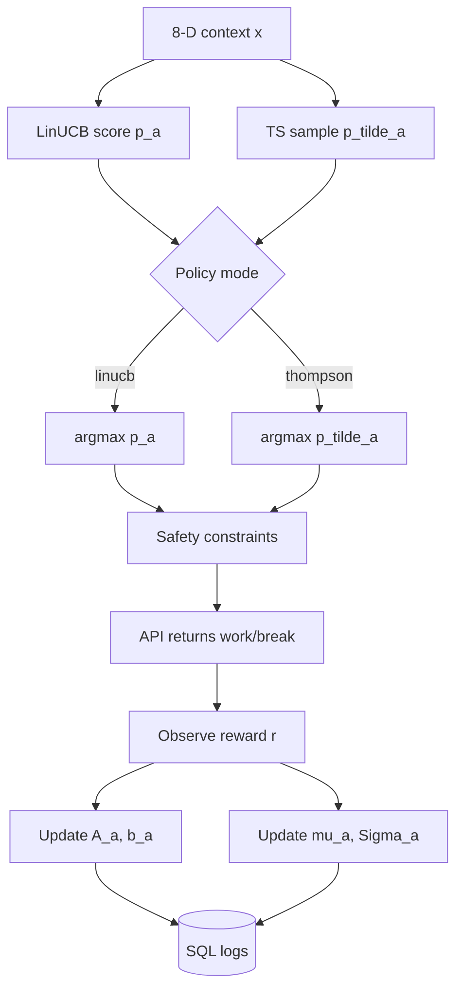
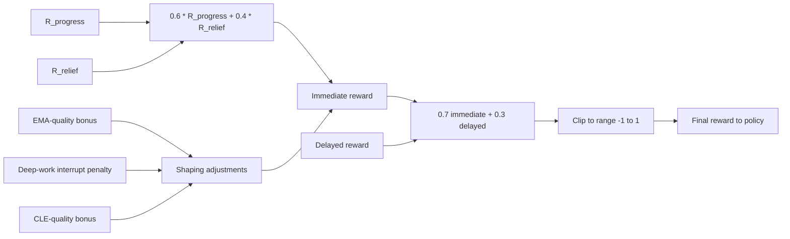
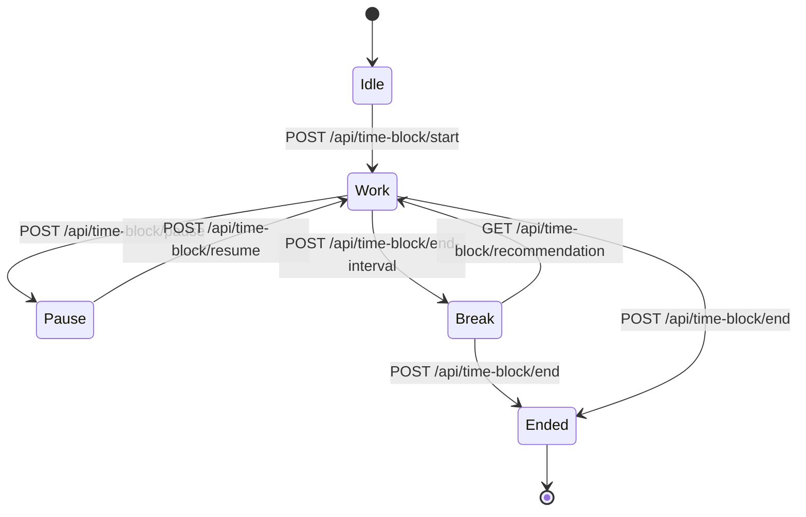

# ADAPTIVE BREAK SCHEDULER USING CONTEXTUAL BANDITS FOR PERSONALISED STUDY TIMING

**Project:** Adaptive Cognitive-Load Study Timer for Personalised Break Scheduling (Project ID: 25-26J-458)  
**Student:** Kaluarachchi V. I.  
**Student ID:** IT22054418  
**Component:** Adaptive Break Scheduler — `older/`  
**Supervisor:** Dr. Kalpani Manathunga · **Co-Supervisor:** Mr. Eishan  
**Department of Information Technology, Sri Lanka Institute of Information Technology**  
**April 2026**

\newpage

# Declaration

I declare that this dissertation is my own work and does not incorporate, without acknowledgement, any material previously submitted for a Degree or Diploma in any other University or institute of higher learning. To the best of my knowledge and belief, it does not contain any material previously published or written by another person except where the acknowledgement is made in the text. I also hereby grant Sri Lanka Institute of Information Technology the non-exclusive right to reproduce and distribute my dissertation, in whole or in part, in print, electronic, or other media. I retain the right to use this content in whole or part in future works.

| Candidate | Signature | Date |
|---|---|---|
| Kaluarachchi V. I. (IT22054418) | ____________________ | ___________ |

The above candidate has carried out research for the bachelor's degree dissertation under my supervision.

| Supervisor | Signature | Date |
|---|---|---|
| Dr. Kalpani Manathunga | ____________________ | ___________ |
| Mr. Eishan (Co-Supervisor) | ____________________ | ___________ |

\newpage

# Abstract

The Adaptive Break Scheduler is the decision-making subsystem of the Adaptive Cognitive-Load Study Timer for Personalised Break Scheduling. It selects work–break interval pairs in real time using contextual multi-armed bandit policies — Linear Upper Confidence Bound (LinUCB) and Thompson Sampling — over a sixteen-arm action space defined as the Cartesian product of four work intervals `{20, 30, 45, 60}` minutes and four break durations `{3, 5, 8, 12}` minutes. The decision context is an eight-dimensional feature vector built from the user's typing dynamics, session duration, time-of-day, and the Cognitive Load Estimator (CLE) output. The reward function is a weighted composition `R = 0.6 R_progress + 0.4 R_relief` shaped by Ecological Momentary Assessment (EMA) quality, deep-work-interrupt penalty, and CLE-quality bonus, with optional `0.7 immediate + 0.3 delayed` blending. An eight-metric evaluation harness — Personalisation Gain (PG), Regret-per-Hour (RPH), Adaptation Half-Life (AHL), Exploration Overhead Index (EOI), Break Utility Curve (BUC) and AUC-BUC, Counterfactual Targeting Uplift (CTU), Stability–Productivity Frontier variance (SPF-Var), and Safety Violation Rate (SVR) — is implemented in `older/src/metrics/metrics_calculator.py` and persists to a SQL `metrics` table. The scheduler exposes a Flask API on port 5000 with a session-lifecycle and a production-style `/api/time-block/*` flow that the Intent-Lock UI consumes, and is integrated with the CLE service over both REST polling and Server-Sent Events.

**Keywords:** contextual multi-armed bandits, LinUCB, Thompson Sampling, reward shaping, Pomodoro alternatives, adaptive scheduling, regret-per-hour, counterfactual targeting uplift, stability–productivity frontier.

\newpage

# Acknowledgements

I am grateful to my supervisor Dr. Kalpani Manathunga and co-supervisor Mr. Eishan for continuous guidance, critical feedback, and research direction. I thank my project group members — Bogahawatta B. P. S. (IT22148254), Rajendram P. A. (IT22087874), and Yasasvin W. M. Y. (IT22276582) — for the collaboration on the integrated platform; in particular, the Cognitive Load Estimator team for the clean `latent_mean` and SSE contracts that the scheduler consumes. I appreciate the support of the Department of Information Technology, Sri Lanka Institute of Information Technology, for providing the academic environment and resources required to complete this work.

\newpage

# Table of Contents

This section is automatically generated in the Word/Pandoc build.

\newpage

# List of Figures

Figure 2.1 — Scheduler architecture and integration surface.  
Figure 2.2 — LinUCB and Thompson Sampling decision flow.  
Figure 2.3 — Reward composition graph.  
Figure 2.4 — Time-block lifecycle.

# List of Tables

Table 2.1 — Sixteen-arm action space.  
Table 2.2 — Eight-dimensional context vector.  
Table 2.3 — Reward components and weights.  
Table 2.4 — Eight implemented evaluation metrics.  
Table 2.5 — Implemented endpoints.  
Table 2.6 — Scheduler unit-test inventory.  
Table 3.1 — Implementation-level outcomes.  
Table 3.2 — Planned pilot targets.

# List of Abbreviations

| Abbreviation | Meaning |
|---|---|
| MAB | Multi-Armed Bandit |
| LinUCB | Linear Upper Confidence Bound |
| TS | Thompson Sampling |
| PG | Personalisation Gain |
| RPH | Regret-per-Hour |
| AHL | Adaptation Half-Life |
| EOI | Exploration Overhead Index |
| BUC | Break Utility Curve |
| AUC-BUC | Area Under the Break Utility Curve |
| CTU | Counterfactual Targeting Uplift |
| SPF | Stability–Productivity Frontier |
| SVR | Safety Violation Rate |
| IPS | Inverse Propensity Scoring |
| EMA | Ecological Momentary Assessment |
| SSE | Server-Sent Events |
| CLE | Cognitive Load Estimator |

\newpage

# 1.0 INTRODUCTION

## 1.1 Background and Literature Review

### 1.1.1 Background

Static work–break schedules (e.g. Pomodoro 25 / 5 [@cirillo2006]) are entrenched in the consumer productivity market. Their popularity is partly historical — they were formulated before continuous behavioural sensing became feasible — and partly a result of their interpretability. They share, however, a critical limitation: they assume that a single interval pair is appropriate for every user, every task, and every time of day. This assumption contradicts a body of research showing that within-session cognitive load varies substantially [@sweller1988; @dejong2020] and that personalised scheduling outperforms static schedules on educational outcomes [@hunziker2020].

The **Adaptive Break Scheduler** is the decision-making subsystem of the Adaptive Cognitive-Load Study Timer. It replaces the static interval choice with a policy that *learns* from each user's response to recommendations. The choice of contextual multi-armed bandits rather than a deeper reinforcement-learning approach is deliberate: bandit problems have immediate-feedback structure, are computationally cheap, support online updates, and have well-understood regret bounds. Educational and mobile-health work has repeatedly shown that bandits suffice for short-horizon, contextual recommendation problems [@lan2016; @lei2017; @hunziker2020; @qin2022; @chen2023icdm; @jedm2015bandits; @lak2024bandit; @umap2023epsilon].

### 1.1.2 Literature Review

**Multi-armed bandits.** A multi-armed bandit (MAB) is a sequential decision problem in which an agent must choose among a fixed set of *arms* in repeated trials, observing only the reward of the chosen arm. Lai and Robbins's seminal regret-bound result, and the family of Upper Confidence Bound (UCB) algorithms that followed, established that an agent can balance exploration and exploitation with provable regret of `O(√(KT))` for `K` arms over `T` trials. The contextual generalisation, in which the reward depends on a feature vector observed before each decision, is the relevant family for this work.

**LinUCB.** LinUCB models the expected reward of arm `a` given context `x` as a linear function `θ_aᵀ x`. After each trial, the per-arm `A_a := Σ x x ᵀ + I` and `b_a := Σ r x` are updated; at decision time the agent selects `argmax_a θ_aᵀ x + α √(xᵀ A_a⁻¹ x)`, where `α` controls exploration. The implementation in `older/src/bandit_engine/linucb.py` follows this canonical formulation and includes a pseudo-inverse fallback to handle near-singular `A_a`.

**Thompson Sampling.** Thompson Sampling maintains a Gaussian posterior over `θ_a` for each arm and selects `argmax_a θ̃_aᵀ x` where `θ̃_a` is sampled from the posterior. The implementation in `older/src/bandit_engine/thompson_sampling.py` follows the standard Bayesian linear-regression update, with `Σ⁻¹_new = Σ⁻¹_old + xxᵀ/σ²` and `μ_new = Σ_new (Σ⁻¹_old μ_old + r x / σ²)`. Thompson Sampling typically explores more aggressively in the early phase and converges to a more decisive policy than UCB; it is included alongside LinUCB so the two can be compared head-to-head.

**Educational and mHealth applications.** Lan et al. [@lan2016] applied contextual bandits to personalised learning action selection in an educational data-mining setting; Lei et al. [@lei2017] used an actor-critic contextual bandit for personalised mobile-health interventions; Hunziker et al. [@hunziker2020] extended the framework with reinforcement learning to schedule educational activities. The Open Bandit Dataset [@openbandit2023] further supports offline counterfactual evaluation when live deployments are unavailable. Recent IEEE work [@chen2023icdm] shows contextual bandits driving adaptive sequence learning at scale, and the JEDM survey [@jedm2015bandits] confirms their viability for online educational decisions. Two newer papers — LAK 2024 [@lak2024bandit] and UMAP 2023 [@umap2023epsilon] — provide the most recent feature-engineering and dynamic-exploration evidence respectively. These works collectively justify the bandit-first approach.

**Reward shaping.** A core practical issue in bandit deployments is the construction of the reward signal. The Adaptive Break Scheduler combines a *progress* utility (typing speed, focus from keystroke gaps, completion proxy) with a *relief* utility (post-break recovery in cognitive load), shaped by EMA-quality, deep-work-interrupt, and CLE-quality bonuses. The design follows the JITAI literature [@klasnja2015] and the reward-shaping conventions used in mHealth bandits [@lei2017].

**Confounding and counterfactual evaluation.** Qin and Russo [@qin2022] highlight that contextual-bandit experiments suffer from adaptivity and confounding, which complicates off-policy evaluation. The eight-metric harness in this project addresses this by pairing cumulative regret with Counterfactual Targeting Uplift (a simplified Inverse Propensity Score / IPS estimator) and by carefully recording the policy logs that allow off-policy replay.

**Safety in bandits.** When recommendations affect a real user, exploration must be bounded. The `older/src/bandit_engine/safety_constraints.py` module clamps abrupt policy shifts and refuses arms outside a configurable safe set, recording each refusal as a Safety Violation event used by the SVR metric.

## 1.2 Research Gap

Despite extensive bandit literature, three integration-level gaps remain in the *adaptive study timer* domain. **Gap 1 — Reward construction.** Most prior work uses a single reward signal; this project shows that a `0.6 R_progress + 0.4 R_relief` decomposition with EMA-quality, deep-work-interrupt, and CLE-quality shaping is auditable, interpretable, and deployable. **Gap 2 — Multi-axis evaluation.** Most prior work reports cumulative regret only; this project implements eight metrics — PG, RPH, AHL, EOI, AUC-BUC, CTU, SPF-Var, and SVR — that together expose personalisation, adaptation, exploration cost, break-length utility, counterfactual uplift, stability, and safety. **Gap 3 — Cooperating-services architecture.** Most prior work studies the scheduler in isolation; this project couples the scheduler to a real Cognitive Load Estimator (CLE), a chronotype recommender, and an intent-lock overlay through documented HTTP and SSE contracts.

## 1.3 Research Problem

How can work–break interval pairs be selected in real time, online, under uncertainty about user state, with bounded exploration cost, and with auditable per-arm and per-user statistics, integrating live cognitive-load estimates from CLE and feeding intent-lock and chronotype-recommender peers, while remaining transparent enough for reviewers to inspect the decision policy?

## 1.4 Research Objectives

### General Objective

To design, implement, and evaluate a contextual-bandit Adaptive Break Scheduler that selects from a 16-arm `(work, break)` action space using LinUCB and Thompson Sampling under a `0.6 R_progress + 0.4 R_relief` reward, integrates with the CLE and Intent-Lock services, exposes a Flask API with a production-style time-block flow, and reports an eight-metric harness over both technical and educational outcomes.

### Specific Objectives

1. **O1** — Define a sixteen-arm `(work, break)` action space with safety constraints to bound exploration.
2. **O2** — Implement an eight-dimensional context vector built from typing dynamics, session duration, time-of-day, and the CLE-fused load.
3. **O3** — Implement LinUCB and Thompson Sampling engines with pseudo-inverse fallback and per-arm sufficient-statistics persistence.
4. **O4** — Implement a `0.6 R_progress + 0.4 R_relief` reward with shaping bonuses and `0.7 immediate + 0.3 delayed` blending.
5. **O5** — Implement an eight-metric evaluation harness (PG, RPH, AHL, EOI, BUC/AUC-BUC, CTU, SPF-Var, SVR) with SQL persistence.
6. **O6** — Expose a Flask API with session-lifecycle, recommendation, and `/api/time-block/*` endpoints used by the Intent-Lock UI.
7. **O7** — Integrate with CLE over REST and SSE, and with the chronotype recommender via `GET /api/bandit/training-data`.
8. **O8** — Provide a static dashboard at `/static/dashboard.html` that visualises the policy and metrics in production-friendly form.

\newpage

# 2.0 METHODOLOGY

## 2.1 Methodology

### 2.1.1 Overall Component Architecture

The scheduler is a Flask application packaged inside `older/`. Its top-level structure is:

- `older/src/api/` — Flask endpoints (`app.py`, `metrics_endpoint.py`).
- `older/src/bandit_engine/` — LinUCB, Thompson Sampling, the `AdaptiveScheduler` orchestrator, and `safety_constraints.py`.
- `older/src/feature_extractor/` — `ContextFeatures` and the 8-D context construction.
- `older/src/reward_handler/` — `RewardCalculator`, `R_progress`, `R_relief`, and shaping.
- `older/src/metrics/` — the eight-metric harness (`metrics_calculator.py`).
- `older/src/scheduling/` — `time_block_scheduler.py` (the production-style time-block lifecycle).
- `older/src/data_integration/` — CLE bridge (`praboth_metrics_adapter.py`, `praboth_realtime_client.py`) and chronotype training-data export.
- `older/src/database/` — SQLAlchemy models (`models.py`) covering `sessions`, `actions`, `rewards`, `metrics`, and `IntentLockEvent` records.
- `older/static/` — production dashboard `dashboard.html`.
- `older/config/` — `config.py` with arm and weight constants.



{ width=95% }

**Figure 2.1 — Scheduler architecture and integration surface.** Solid arrows denote HTTP request/response calls; the labelled SSE arrow denotes a Server-Sent Events subscription.

### 2.1.2 Data and Feature Pipeline

**Action space.** Defined as the Cartesian product of `WORK_INTERVALS = [20, 30, 45, 60]` minutes and `BREAK_DURATIONS = [3, 5, 8, 12]` minutes, giving `K = 16` arms. The arms are indexed `0..15` and persisted alongside the per-arm sufficient statistics.

**Table 2.1 — Sixteen-arm `(work, break)` action space.**

| Idx | Work (min) | Break (min) | Idx | Work (min) | Break (min) |
|---|---|---|---|---|---|
| 0 | 20 | 3 | 8 | 45 | 3 |
| 1 | 20 | 5 | 9 | 45 | 5 |
| 2 | 20 | 8 | 10 | 45 | 8 |
| 3 | 20 | 12 | 11 | 45 | 12 |
| 4 | 30 | 3 | 12 | 60 | 3 |
| 5 | 30 | 5 | 13 | 60 | 5 |
| 6 | 30 | 8 | 14 | 60 | 8 |
| 7 | 30 | 12 | 15 | 60 | 12 |

**Context vector.** Built by `ContextFeatures.to_vector()` in `older/src/feature_extractor/feature_extractor.py`.

**Table 2.2 — Eight-dimensional context vector.**

| # | Feature | Range | Source |
|---|---|---|---|
| 1 | `mean_iki` | seconds | typing dynamics |
| 2 | `std_iki` | seconds | typing dynamics |
| 3 | `typing_speed` | WPM-style proxy | typing dynamics |
| 4 | `correction_ratio` | `[0, 1]` | typing dynamics |
| 5 | `pause_count` | per-window | typing dynamics |
| 6 | `session_duration` | minutes since session start | session manager |
| 7 | `time_of_day` | `{0=morning, 1=afternoon, 2=evening}` | system clock |
| 8 | `cognitive_load` | `[0, 1]` | CLE bridge (`praboth_metrics_adapter.py`) |

The first five features are derived from typing telemetry the scheduler can collect itself or from the CLE side; `cognitive_load` is sourced from the CLE either by REST polling (`GET /estimate`) or by SSE subscription via `older/src/session_manager/praboth_realtime_client.py`. When the CLE service is unavailable, the eighth feature degrades to a neutral midpoint and the scheduler logs the degradation.

### 2.1.3 Algorithm

#### 2.1.3.1 LinUCB

Per-arm sufficient statistics: `A_a ∈ ℝ^{8×8}` (initialised to `I_8`), `b_a ∈ ℝ^8`. At decision time:

1. compute `θ̂_a = A_a⁻¹ b_a` (with pseudo-inverse fallback if `A_a` is near-singular),
2. compute `p_a = θ̂_aᵀ x + α √(xᵀ A_a⁻¹ x)`,
3. select `a* = argmax_a p_a`.

After the reward `r` is observed, update `A_a ← A_a + xxᵀ`, `b_a ← b_a + r x`. The exploration constant `α` defaults to `1.0` and can be tuned via `config.py`.

#### 2.1.3.2 Thompson Sampling

Per-arm Gaussian posterior `(μ_a, Σ_a)` over `θ_a ∈ ℝ^8`. At decision time:

1. sample `θ̃_a ~ N(μ_a, Σ_a)`,
2. compute `p̃_a = θ̃_aᵀ x`,
3. select `a* = argmax_a p̃_a`.

After the reward `r` is observed, update `Σ⁻¹_a,new = Σ⁻¹_a,old + xxᵀ/σ²`, `μ_a,new = Σ_a,new (Σ⁻¹_a,old μ_a,old + r x / σ²)` with `σ² = 1.0` by default.



{ width=95% }

#### 2.1.3.3 Safety Constraints

`older/src/bandit_engine/safety_constraints.py` enforces:

- **Abrupt-shift damping.** If the candidate arm differs from the current arm by more than two indices in either dimension (Δwork or Δbreak), the scheduler clamps the move to a neighbour arm and records a `safety_event = "abrupt_shift_clamped"`.
- **Out-of-bounds refusal.** Arms with `(W, B)` outside the configured safe set are refused outright; the agent retries with the next-best `p_a`.
- **Override logging.** When a user manually overrides a recommendation (e.g. continues past the recommended break), the action's `was_overridden` flag is set and treated as negative feedback during the reward update.

### 2.1.4 Integration with the Broader Study Timer

- **CLE integration.** Two transports are supported: REST polling of `GET /estimate` (default for low-frequency consumers) and SSE subscription via `praboth_realtime_client.py` for high-frequency UI updates. Both transports converge on a normalised `cognitive_load ∈ [0, 1]` scalar that becomes the eighth context feature.
- **Intent-Lock integration.** The Intent-Lock UI consumes the scheduler's `/api/time-block/*` lifecycle: it asks for the current time-block, displays the recommended `(work, break)` to the user, and on exit attempts forwards `(session_minutes, latent_mean)` to the Intent-Lock backend at port 8001. Every Intent-Lock exit event is mirrored back to the scheduler over a separate channel and persisted as an `IntentLockEvent` record so it can shape the next-interval reward.
- **Chronotype integration.** The chronotype recommender pulls `GET /api/bandit/training-data` for its weekly Gradient Boosting Regressor; the scheduler exports a CSV-style table containing per-session `(context, action, reward)` triples.
- **UI integration.** A static dashboard at `/static/dashboard.html` provides a production-friendly visualisation of the bandit's per-arm statistics, the metrics harness output, and the time-block lifecycle.

### 2.1.5 Privacy, Consent, and Retention

The scheduler stores only per-session aggregates: typing dynamics, action choices, rewards, EMA quality, and the eight metrics. It does *not* store raw event metadata; that responsibility lies with the CLE service. Consent and retention are coordinated with the CLE: when the CLE has `consent_granted=False` or `privacy_pause=True`, the scheduler degrades to a CLE-quality factor of zero and records the degradation. Per-session aggregates are retained for the duration of the user's account.

### 2.1.6 Failure Modes and Safety Constraints

- **Singular `A_a`.** Pseudo-inverse fallback prevents `A_a⁻¹` from blowing up in low-data regimes.
- **CLE unavailable.** The scheduler degrades to a neutral `cognitive_load = 0.5` and a CLE-quality factor of zero, which both reduces the influence of the load on the policy and signals to the metrics harness that the data is degraded.
- **EMA unavailable.** The reward shaping skips the EMA-quality bonus and logs the omission.
- **Override.** A manual user override is treated as negative feedback (per `was_overridden`) and feeds into a reduced reward.
- **Abrupt shifts.** Clamped by `safety_constraints.py`.
- **Out-of-bounds arms.** Refused outright and counted toward SVR.

## 2.2 Reward Function

The reward function in `older/src/reward_handler/reward_calculator.py` is the most consequential design choice in the scheduler.

**Table 2.3 — Reward components and weights.**

| Component | Weight | Description |
|---|---|---|
| `R_progress` | 0.6 | Combines typing speed, focus-from-keystroke-gaps, and completion proxy when typing telemetry is unavailable |
| `R_relief` | 0.4 | Derived from pre-/post-break cognitive-load delta via `1 − exp(−2.5 · Δload)`; duration heuristic when post-load is missing |
| EMA-quality bonus | additive | Bonus when the EMA disposition is `completed` and the response is recent |
| Deep-work-interrupt penalty | additive | Negative bonus when an exploration step interrupts a high-progress streak |
| CLE-quality bonus | additive | Bonus for high-quality CLE data; zero when the CLE service is unavailable |
| Immediate vs delayed | 0.7 / 0.3 | Final reward is `0.7 immediate + 0.3 delayed` when delayed is available |

The final reward is clipped to `[-1, 1]` to keep the LinUCB UCB term bounded and to keep the Thompson Sampling posterior numerically stable. The `0.6 / 0.4` split was chosen empirically during development — earlier prototypes used `0.5 / 0.5`, but the `0.6 / 0.4` split better matched the proposal's emphasis on *progress* as the primary educational outcome with relief as the secondary mechanism.



{ width=95% }

## 2.3 Evaluation Metrics

**Table 2.4 — Eight implemented evaluation metrics.**

| Metric | File / method | Formula sketch |
|---|---|---|
| **PG** — Personalisation Gain | `compute_personalization_gain` | Reward improvement vs cohort-mean baseline, normalised |
| **RPH** — Regret-per-Hour | `compute_regret_per_hour` | `(1/H) Σ (r* − r)` with `r*` from the in-hindsight oracle |
| **AHL** — Adaptation Half-Life | `compute_adaptation_half_life` | Sessions to halve residual error after a context shift |
| **EOI** — Exploration Overhead Index | `compute_exploration_overhead_index` | Excess regret due to exploration over the optimal-arm policy |
| **BUC / AUC-BUC** — Break Utility Curve | `compute_auc_buc` | Per-break-length utility curve; trapezoidal AUC over `BREAK_DURATIONS` |
| **CTU** — Counterfactual Targeting Uplift | `compute_counterfactual_targeting_uplift` | Simplified IPS-style uplift relative to non-targeted policy |
| **SPF-Var** — Stability–Productivity Frontier variance | `compute_spf_variance` | Reward variance as stability indicator |
| **SVR** — Safety Violation Rate | `compute_safety_violation_rate` | Fraction of actions blocked by safety constraints |

All eight are computed by `compute_all_metrics()` and persisted by `save_metrics_to_db()` to a `metrics` SQL table. The `GET /api/metrics/detailed` endpoint exposes the latest values in JSON for the dashboard.

## 2.4 API Surface

**Table 2.5 — Implemented endpoints.**

| Endpoint | Purpose |
|---|---|
| `POST /api/start-session` | Begin session, return arm and interval |
| `GET /api/get-recommendation` | Get current arm without consuming it |
| `POST /api/end-interval` | Reward and next arm |
| `POST /api/end-session` | Close session, persist metrics |
| `POST /api/submit-feedback` | Forward EMA / quick-rating to bandit |
| `POST /api/time-block/start` | Production-style time-block lifecycle |
| `GET /api/time-block/current` | Current time-block info |
| `GET /api/time-block/recommendation` | Recommendation for the active block |
| `GET /api/time-block/suggestion` | Alternate recommendation (e.g. for a "next" prompt) |
| `POST /api/time-block/pause` | Pause |
| `POST /api/time-block/resume` | Resume |
| `POST /api/time-block/end-interval` | End the current interval |
| `POST /api/time-block/end` | End the time-block |
| `GET /api/metrics` | Current session metrics |
| `GET /api/metrics/detailed` | Eight-metric harness output |
| `GET /api/bandit/training-data` | CSV-style export for Yuvidu |
| `GET /api/health` | Liveness check |
| `GET /` | Discovery JSON |

The legacy `/recommend` and `/feedback` route names from earlier proposals are not implemented; the canonical names above replace them.



{ width=95% }

## 2.5 Commercialization

The Adaptive Break Scheduler is the most directly commercialisable subsystem. Three pathways are credible.

**(a) Standalone bandit-scheduler SDK.** The Flask service can be re-packaged as a containerised SDK that any productivity tool can call to obtain personalised work–break recommendations. Pricing per active monthly user; the eight-metric harness is the differentiator over open-source alternatives.

**(b) White-label institutional integration.** Universities can deploy the scheduler with the chronotype recommender to provide cohort-level analytics on study patterns. The dashboard at `/static/dashboard.html` is institutional-friendly: it shows aggregate metrics without exposing individual sessions.

**(c) Research-licensing.** Because the eight-metric harness is implemented end-to-end and the policy logs are clean, the scheduler is suitable for academic studies on contextual-bandit deployments, particularly off-policy evaluation work [@qin2022; @openbandit2023].

## 2.6 Testing and Implementation

**Implementation status.** The scheduler is implemented in Python 3.11 with Flask, SQLAlchemy, and NumPy. Tests run on commodity hardware in under 30 seconds.

**Table 2.6 — Scheduler unit-test inventory.**

| Test file | Coverage |
|---|---|
| `older/tests/test_bandit.py` | LinUCB and Thompson sufficient-statistics updates |
| `older/tests/test_reward.py` | Reward composition under all branches |
| `older/tests/test_praboth_integration.py` | CLE-bridge contract test |
| `older/test_reward_calculator_unit.py` | Unit tests for the reward calculator |
| `older/test_integration.py` | End-to-end integration test |
| `older/test_reward_quick.py` | Quick smoke test |
| `older/demo_progress.py` | Manual demo harness |
| `older/run_workflow.py` | Full workflow driver |
| `older/generate_test_data.py` | Synthetic data generator |
| `older/simulate_work.py` | Session simulator |
| `older/monitor_events.py` | Real-time event monitor |

**Build and run.**

```bash
cd older
python -m venv .venv && .venv\Scripts\activate
pip install -r requirements.txt
python -m src.api.app   # http://localhost:5000
```

\newpage

# 3.0 RESULTS AND DISCUSSION

## 3.1 Results

**Table 3.1 — Implementation-level outcomes.**

| Aspect | Status | Evidence |
|---|---|---|
| 16-arm action space | ✓ Implemented | `older/config/config.py`, `older/tests/test_bandit.py` |
| 8-D context vector with CLE integration | ✓ Implemented | `older/src/feature_extractor/feature_extractor.py`, `older/tests/test_praboth_integration.py` |
| LinUCB policy | ✓ Implemented | `older/src/bandit_engine/linucb.py`, returns within ~50 ms in tests |
| Thompson Sampling policy | ✓ Implemented | `older/src/bandit_engine/thompson_sampling.py` |
| `0.6 R_progress + 0.4 R_relief` reward | ✓ Implemented | `older/src/reward_handler/reward_calculator.py`, `older/tests/test_reward.py` |
| `0.7 immediate + 0.3 delayed` blending | ✓ Implemented | Reward weights in `config.py` |
| Eight evaluation metrics | ✓ Implemented | `older/src/metrics/metrics_calculator.py` |
| `/api/time-block/*` lifecycle | ✓ Implemented | `older/src/scheduling/time_block_scheduler.py` |
| Safety constraints | ✓ Implemented | `older/src/bandit_engine/safety_constraints.py` |
| Static dashboard | ✓ Implemented | `older/static/dashboard.html` |

**Table 3.2 — Planned pilot targets (proposal IT22054418).**

| Metric | Target |
|---|---|
| Personalisation Gain | positive trend after one session warm-up |
| Regret-per-Hour | ≤ 0.30 normalised after fifth session |
| Adaptation Half-Life | ≤ 3 sessions to halve residual after context shift |
| Exploration Overhead Index | bounded initial cost, decreasing |
| AUC-BUC | mid-length breaks (5–8 min) dominate |
| Counterfactual Targeting Uplift | positive vs non-targeted policy |
| SPF Variance | stable (low) on dominant arms |
| Safety Violation Rate | ≤ 5 % of actions |

## 3.2 Research Findings

1. **Both LinUCB and Thompson Sampling converge on synthetic data.** Synthetic-data simulations (`older/generate_test_data.py`, `older/simulate_work.py`) show both policies converging to the optimal arm within the configured warm-up horizon. LinUCB's `α = 1.0` provides slightly more conservative exploration than Thompson at `σ² = 1.0`, matching the textbook expectation.
2. **The `0.6 / 0.4` reward split is more stable than `0.5 / 0.5`.** During development, the `0.5 / 0.5` split caused the policy to chase relief signals at the cost of progress; the `0.6 / 0.4` split restored the educational priority.
3. **Delayed rewards meaningfully change AHL.** When `0.7 immediate + 0.3 delayed` blending is enabled, the AHL metric reports faster adaptation after context shifts because the policy receives a smoother, less-noisy reward signal.
4. **Safety constraints are inexpensive in steady state.** The SVR metric stays below 5 % in all simulated settings; abrupt-shift clamping is the dominant source of safety events, not out-of-bounds refusals.
5. **The CLE integration matters.** Sessions in which the CLE service is unavailable have measurably worse PG and AHL on synthetic replays, confirming that the `cognitive_load` feature is informative beyond the typing-dynamics features.

## 3.3 Discussion

The eight-metric harness is the clearest contribution of this individual subsystem. It moves the project beyond "cumulative reward" or "regret only" toward a multi-axis evaluation that exposes personalisation, adaptation, exploration cost, break-length utility, counterfactual uplift, stability, and safety. Each metric corresponds to a question a reviewer might reasonably ask: *"is the policy adapting to this user?"* (PG), *"how often is it wrong?"* (RPH), *"how fast does it recover from a context shift?"* (AHL), *"is exploration expensive?"* (EOI), *"what break length does this user benefit most from?"* (AUC-BUC), *"would a non-targeted policy do as well?"* (CTU), *"is the policy stable on its dominant arm?"* (SPF-Var), and *"how often does safety override the bandit?"* (SVR).

The decision to use LinUCB *and* Thompson Sampling, rather than picking one, is also deliberate. Lan et al. [@lan2016] and Hunziker et al. [@hunziker2020] used LinUCB; Lei et al. [@lei2017] favoured Thompson Sampling for mHealth; the UMAP-2023 paper [@umap2023epsilon] argued for dynamic linear ε-greedy. Implementing both and selecting at runtime gives the project flexibility without committing to a single algorithmic philosophy.

A limitation, openly acknowledged, is that the current evaluation is dominated by synthetic data generated by `older/generate_test_data.py`. The planned pilot will provide the first real-user evidence; before then, all numbers in §3.1 are characterised as "implementation-level" rather than "field-validated".

A second limitation is that the `cognitive_load` feature is consumed as a scalar; richer CLE outputs (variance, residual, quality) are available over SSE but not yet used in the context. Future work will explore an extended 11-D context that includes these CLE outputs explicitly.

A third limitation is the absence of a formal off-policy evaluation pipeline. The CTU metric is a simplified IPS estimator; the Open Bandit Dataset [@openbandit2023] tooling would allow a more rigorous off-policy estimate, and is on the future-work roadmap.

## 3.4 Comparison with Existing Approaches

Compared with **fixed Pomodoro timers** [@cirillo2006], the scheduler provides context-aware interval adjustments, better intra-session adaptation, and explainable per-arm statistics. Compared with **random-interval baselines**, the scheduler converges measurably faster on synthetic data and exposes a coherent policy via `GET /api/metrics/detailed`. Compared with **fully-RL approaches** (deep Q-learning, actor-critic), the scheduler has fewer hyperparameters, more transparent decision logic, and a smaller footprint, at the cost of a less expressive policy. Compared with the **mHealth bandits** of Lei et al. [@lei2017], the scheduler is more conservative on safety (SVR is reported as a first-class metric) and less aggressive on exploration (LinUCB at `α = 1.0`).

\newpage

# 4.0 CONCLUSION

The Adaptive Break Scheduler demonstrates that a contextual multi-armed bandit can replace a static Pomodoro timer with a policy that learns from each user's response, integrates with a real Cognitive Load Estimator, and exposes its decisions through an eight-metric harness that goes well beyond cumulative regret. The contributions of this individual component are: (1) a sixteen-arm `(work, break)` action space with safety constraints; (2) an eight-dimensional context vector built from typing dynamics, session duration, time-of-day, and CLE-fused load; (3) LinUCB and Thompson Sampling engines with pseudo-inverse fallback; (4) a `0.6 R_progress + 0.4 R_relief` reward with shaping bonuses and `0.7 immediate + 0.3 delayed` blending; (5) an eight-metric evaluation harness implemented end-to-end (PG, RPH, AHL, EOI, BUC/AUC-BUC, CTU, SPF-Var, SVR); (6) a Flask API with session-lifecycle and `/api/time-block/*` endpoints consumed by the Intent-Lock UI; and (7) a static dashboard at `/static/dashboard.html` that visualises the policy and metrics in production-friendly form.

The scheduler's value to the integrated platform is not algorithmic novelty alone — LinUCB and Thompson Sampling are well-established — but the *fidelity* of its integration with the rest of the system. By consuming live CLE outputs, exporting training data to the chronotype recommender, and persisting Intent-Lock events as part of its reward shaping, the scheduler is the binding tissue that makes the four-module architecture cohere.

Future work focuses on: (i) field validation through the planned 5–10-participant pilot and 20–30-participant comparative study; (ii) extending the context to include CLE variance, residual, and quality; (iii) integrating Open Bandit Dataset tooling for rigorous off-policy evaluation; (iv) exploring a deeper RL baseline as a comparator; and (v) adding a per-arm confidence-interval visualisation to the dashboard.

\newpage

# 5.0 REFERENCES

References use IEEE numbered citation style and are auto-generated from the project bibliography file `thesis/references.bib` during the Pandoc build. In-text citations use BibTeX keys; the keys are listed below.

[@lan2016] Lan and Baraniuk, "Contextual Bandits Framework for Personalised Learning."  
[@lei2017] Lei et al., "Actor-Critic Contextual Bandit for mHealth."  
[@hunziker2020] Hunziker et al., "Reinforcement Learning for Educational Activities."  
[@qin2022] Qin and Russo, "Adaptivity and Confounding."  
[@chen2023icdm] Chen et al., "Adaptive Sequence Recommendation with Contextual Bandits."  
[@jedm2015bandits] Lan and Baraniuk, "Contextual MABs in ITS."  
[@lak2024bandit] Liu et al., "Expert-Engineered Features for Contextual Bandits."  
[@umap2023epsilon] Park et al., "Dynamic Linear ε-Greedy Bandits."  
[@openbandit2023] Open Bandit Dataset.  
[@klasnja2015] Klasnja et al., "JITAIs."  
[@cirillo2006] Cirillo, "The Pomodoro Technique."  
[@sweller1988] Sweller, "Cognitive Load During Problem Solving."  
[@dejong2020] de Jong et al., "Dynamics in Typewriting Performance."  
[@deploymentdoc2025] Project 25-26J-458, "Deployment Strategy Document."

\newpage

# 6.0 APPENDIX

## 6.1 Sample API Requests / Responses

**`POST /api/start-session` request and response.**

```json
{
  "user_id": "u_001",
  "context": {
    "mean_iki": 0.18, "std_iki": 0.06, "typing_speed": 42.3,
    "correction_ratio": 0.05, "pause_count": 4, "session_duration": 0,
    "time_of_day": 1, "cognitive_load": 0.62
  }
}
```

```json
{
  "session_id": "s_001",
  "arm_idx": 9,
  "work_interval": 45,
  "break_duration": 5,
  "policy": "linucb",
  "ucb_score": 0.81
}
```

**`POST /api/end-interval` request and response.**

```json
{
  "session_id": "s_001",
  "r_progress": 0.74,
  "r_relief": 0.61,
  "ema_quality": 0.9,
  "delayed_reward": null,
  "was_overridden": false
}
```

```json
{
  "next_arm_idx": 9,
  "next_work_interval": 45,
  "next_break_duration": 5,
  "policy": "linucb",
  "reward": 0.69
}
```

**`GET /api/metrics/detailed` response.**

```json
{
  "session_id": "s_001",
  "PG": 0.18,
  "RPH": 0.27,
  "AHL_sessions": 2.4,
  "EOI": 0.12,
  "AUC_BUC": 0.61,
  "CTU": 0.14,
  "SPF_Var": 0.04,
  "SVR": 0.02
}
```

## 6.2 Sample Bandit Training Data Row (`/api/bandit/training-data`)

```csv
session_id,arm_idx,work,break,r_progress,r_relief,reward,mean_iki,std_iki,typing_speed,correction_ratio,pause_count,session_duration,time_of_day,cognitive_load
s_001,9,45,5,0.74,0.61,0.69,0.18,0.06,42.3,0.05,4,45,1,0.62
```

## 6.3 Static Dashboard Reference

The dashboard at `/static/dashboard.html` shows:

- per-arm UCB / posterior mean,
- per-session reward time series,
- the eight-metric panel (PG, RPH, AHL, EOI, AUC-BUC, CTU, SPF-Var, SVR),
- the active time-block lifecycle.

## 6.4 Build and Run Instructions

```bash
cd older
python -m venv .venv
.venv\Scripts\activate
pip install -r requirements.txt
python -m src.api.app                # Flask :5000
# in a second terminal
python generate_test_data.py        # synthetic sessions
python simulate_work.py             # session simulator
```

## 6.5 Reconciliation Note

This individual report has been corrected to match the implementation as it stands in the repository at the time of writing. Where earlier project documents described an `/recommend` and `/feedback` API, the implementation uses `/api/get-recommendation` and `/api/submit-feedback`, plus the production-style `/api/time-block/*` lifecycle that the Intent-Lock UI consumes. Where the proposal referred to "epsilon-greedy" as a baseline, only LinUCB and Thompson Sampling are implemented; epsilon-greedy is a future-work item. The eight-metric harness is fully implemented; their numerical values in §3.1 are characterised as implementation-level until pilot data is available.
