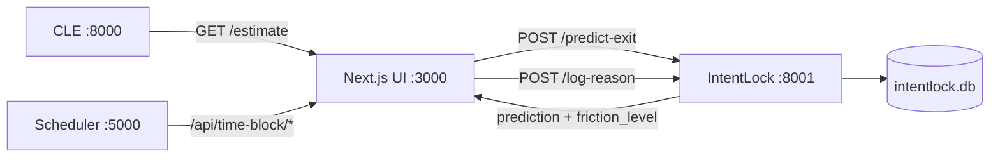

# INTENT-LOCK OVERLAY FOR DISTRACTION PREVENTION IN ADAPTIVE STUDY TIMING

**Project:** Adaptive Cognitive-Load Study Timer for Personalised Break Scheduling (Project ID: 25-26J-458)  
**Student:** Rajendram P. A.  
**Student ID:** IT22087874  
**Component:** Intent-Lock Overlay — `newer/andrew/`  
**Supervisor:** Dr. Kalpani Manathunga · **Co-Supervisor:** Mr. Eishan  
**Department of Information Technology, Sri Lanka Institute of Information Technology**  
**April 2026**

\newpage

# Declaration

I declare that this dissertation is my own work and does not incorporate, without acknowledgement, any material previously submitted for a Degree or Diploma in any other University or institute of higher learning. To the best of my knowledge and belief, it does not contain any material previously published or written by another person except where the acknowledgement is made in the text. I also hereby grant Sri Lanka Institute of Information Technology the non-exclusive right to reproduce and distribute my dissertation, in whole or in part, in print, electronic, or other media. I retain the right to use this content in whole or part in future works.

| Candidate | Signature | Date |
|---|---|---|
| Rajendram P. A. (IT22087874) | ____________________ | ___________ |

The above candidate has carried out research for the bachelor's degree dissertation under my supervision.

| Supervisor | Signature | Date |
|---|---|---|
| Dr. Kalpani Manathunga | ____________________ | ___________ |
| Mr. Eishan (Co-Supervisor) | ____________________ | ___________ |

\newpage

# Abstract

The Intent-Lock Overlay is the distraction-prevention subsystem of the Adaptive Cognitive-Load Study Timer for Personalised Break Scheduling. It classifies user exit attempts as *impulsive* or *genuine* using a `LogisticRegression` model trained on 500 synthetic samples drawn from a `Beta(2, 3)` cognitive-load distribution and a piecewise-uniform session-length distribution, and it applies three levels of graduated friction governed by the per-session count of previous impulsive attempts. Level 0 is a gentle prompt; Level 1 captures a structured exit reason; Level 2 applies a three-second confirmation countdown. The model takes only two features — `session_minutes` and `latent_mean` — both of which are already available in the live runtime stack. The backend is a FastAPI service on port 8001 with two endpoints, `POST /predict-exit` and `POST /log-reason`, and a SQLite store with three tables (`synthetic_training_data`, `exit_events`, `exit_reasons`). The overlay is realised as the `IntentLockModal.tsx` Next.js component used by `intentlock-frontend/app/page.tsx`. An in-tree evaluator (`evaluate_model.py`) reports training-set accuracy, per-class accuracy, confusion matrix, precision, recall, and F1 over the 500 synthetic samples, with `Progress_Summary.md` recording an indicative ~75.6 % overall accuracy and ~86.9 % accuracy on the genuine class as a preliminary baseline. The Decision Tree alternative classifier and OS-wide application-switch interception described in proposal IT22087874 are deliberately deferred to future work.

**Keywords:** intent-lock, impulsive exit, graduated friction, logistic regression, reflective intervention, digital self-control, cognitive load, ecological momentary assessment.

\newpage

# Acknowledgements

I am grateful to my supervisor Dr. Kalpani Manathunga and co-supervisor Mr. Eishan for continuous guidance, critical feedback, and research direction. I thank my project group members — Bogahawatta B. P. S. (IT22148254), Kaluarachchi V. I. (IT22054418), and Yasasvin W. M. Y. (IT22276582) — for the collaboration on the integrated platform; in particular, the Cognitive Load Estimator team for the `latent_mean` signal that feeds the classifier, and the Adaptive Break Scheduler team for the `/api/time-block/*` lifecycle that the Intent-Lock UI consumes. I appreciate the support of the Department of Information Technology, Sri Lanka Institute of Information Technology, for providing the academic environment and resources required to complete this work.

\newpage

# Table of Contents

This section is automatically generated in the Word/Pandoc build.

\newpage

# List of Figures

Figure 2.1 — Intent-Lock architecture and integration surface.  
Figure 2.2 — Three-level friction state machine.  
Figure 2.3 — Synthetic data distribution: Beta(2,3) load and piecewise session length.  
Figure 2.4 — Exit-event lifecycle through the SQLite schema.

# List of Tables

Table 2.1 — Synthetic data generation rules.  
Table 2.2 — Friction levels.  
Table 2.3 — SQLite schema.  
Table 2.4 — Implemented endpoints.  
Table 2.5 — Intent-Lock unit-test inventory.  
Table 3.1 — Implementation-level outcomes.  
Table 3.2 — Indicative `evaluate_model.py` numbers.

# List of Abbreviations

| Abbreviation | Meaning |
|---|---|
| LR | Logistic Regression |
| DT | Decision Tree (future work) |
| CLE | Cognitive Load Estimator |
| EMA | Ecological Momentary Assessment |
| HCI | Human–Computer Interaction |
| DSCT | Digital Self-Control Tool |
| F1 | Harmonic mean of precision and recall |
| API | Application Programming Interface |

\newpage

# 1.0 INTRODUCTION

## 1.1 Background and Literature Review

### 1.1.1 Background

A consistent finding in HCI research on study and productivity is that *binary* distraction interventions — strict blockers, all-or-nothing lockouts — produce resistance, rebound, and abandonment [@mark2018; @lyngs2019]. Reflective friction, by contrast, reduces impulsive behaviour while preserving user autonomy [@matthies2023; @kim2019]. The "one sec" intervention reported a 57 % reduction in reflexive social-media opens through a single brief reflective pause [@matthies2023]. The implication for study tools is clear: distraction prevention should be *graduated and context-aware* rather than binary.

The **Intent-Lock Overlay** is the distraction-prevention subsystem of the Adaptive Cognitive-Load Study Timer for Personalised Break Scheduling. It classifies each exit attempt as *impulsive* or *genuine* and applies one of three friction levels — gentle prompt, reason capture, or confirmation countdown — depending on how many impulsive attempts have already been logged in the current session. The classifier is a `sklearn.linear_model.LogisticRegression` model with `max_iter=1000` and `random_state=42`, trained on 500 synthetic samples generated to match the Cognitive-Load-Theory rationale described in `newer/andrew/intentlock-backend/data/RESEARCH_BACKING.md`. The two features are `session_minutes` (how long the current session has been active) and `latent_mean` (a rolling average of the CLE-fused cognitive load), both of which are already available in the live runtime stack.

### 1.1.2 Literature Review

Six themes directly motivate the Intent-Lock design.

**Cost of interruption.** Mark et al.'s seminal CHI paper on the cost of interrupted work [@mark2018] established that interruptions, even self-imposed ones, increase speed and stress at the cost of accuracy and mood. The implication for a study tool is that interventions that *prevent* unnecessary interruptions are valuable to the user, even if they are momentarily inconvenient.

**Digital self-control tools.** Lyngs et al.'s review of digital self-control tools [@lyngs2019] identified two broad design strategies: *blockers* (strict, all-or-nothing) and *reflectors* (interventions that prompt awareness or reflection). The review concluded that strict blockers tend to be uninstalled or bypassed; reflective tools are retained more reliably.

**Reflective friction.** Matthies et al.'s study of the "one sec" iOS intervention [@matthies2023] reported a 57 % reduction in reflexive social-media opens through a single brief reflective pause inserted before the app launches. Kim et al.'s CHI paper [@kim2019] generalised friction-as-design-strategy across a range of digital products. Both works support the use of *light-touch* friction over heavy-handed blocking.

**Affective state computing.** D'Mello and Graesser [@dmello2015] argued for lightweight in-the-loop classifiers that drive context-aware UI behaviour without requiring heavy ML dependencies. The Intent-Lock classifier follows this principle: a single `LogisticRegression` model with two features is computationally trivial, interpretable, and easy to retrain on per-user data.

**Modelling cognitive engagement.** Zhou et al.'s JEDM paper [@zhou2020] modelled cognitive engagement using low-cost behavioural features in learning environments and showed that simple features (latency, error rate) suffice for many engagement-detection tasks. The two-feature `(session_minutes, latent_mean)` model in this work is in the same spirit.

**Self-regulation development.** Duckworth, Gendler, and Gross [@duckworth2016] reviewed self-control development in school-age children and emphasised that awareness-based interventions (i.e. those that prompt the user to *notice* the impulse before acting) are more effective than punitive ones. Reflective friction in Intent-Lock is the operational analogue.

## 1.2 Research Gap

Despite extensive HCI literature on digital self-control, three integration-level gaps remain. **Gap 1 — Predictive friction.** Most existing tools apply a fixed friction level regardless of the user's state; Intent-Lock predicts the impulsive-vs-genuine class first and only escalates friction when the prediction supports it. **Gap 2 — Per-session escalation.** Most reflective tools reset between sessions; Intent-Lock counts impulsive exits within a session and escalates the friction level on repeat offences. **Gap 3 — Cooperating-services architecture.** Most reflective tools live in their own silo; Intent-Lock consumes the live `latent_mean` from CLE and is mounted directly inside the Next.js Pomodoro UI used by the rest of the project, so the friction modal appears at the right moment in the right context.

## 1.3 Research Problem

How can impulsive exits from a study session be reduced through predictive, graduated friction, using only features already available in the runtime stack (CLE-derived `latent_mean` and `session_minutes`), while preserving user autonomy for genuine exits, and producing structured reflection logs that can later inform both the scheduler and the UI?

## 1.4 Research Objectives

### General Objective

To design, implement, and evaluate a predictive, graduated-friction Intent-Lock overlay that uses a two-feature `LogisticRegression` classifier to triage exit attempts and a per-session counter to escalate friction levels, deployed as a FastAPI service mounted inside the integrated Next.js UI.

### Specific Objectives

1. **O1** — Design a synthetic data generator grounded in Cognitive Load Theory to bootstrap the classifier when real-user labels are unavailable.
2. **O2** — Implement a `LogisticRegression` classifier over `(session_minutes, latent_mean)` and train it at boot time if the persisted artefact is missing.
3. **O3** — Implement a three-level friction state machine selected by `count_impulsive_exits(session_id)`.
4. **O4** — Implement a SQLite schema with three tables (`synthetic_training_data`, `exit_events`, `exit_reasons`) for traceability.
5. **O5** — Expose a FastAPI service on port 8001 with `POST /predict-exit` and `POST /log-reason` endpoints.
6. **O6** — Implement an in-tree evaluator that reports training-set accuracy, per-class accuracy, confusion matrix, precision, recall, and F1.
7. **O7** — Mount the `IntentLockModal.tsx` overlay inside the integrated Next.js UI at `intentlock-frontend/app/page.tsx`.
8. **O8** — Document the Decision Tree alternative classifier and OS-wide application-switch interception as future work.

\newpage

# 2.0 METHODOLOGY

## 2.1 Methodology

### 2.1.1 Overall Component Architecture

The Intent-Lock backend is a small FastAPI application packaged at `newer/andrew/intentlock-backend/`. Its top-level structure is:

- `main.py` — FastAPI app, the two endpoints, the friction-level state machine, and the bootstrap path that trains the model if the artefact is missing.
- `models/model.py` — the `LogisticRegression` wrapper with `train`, `predict`, and `save_model` / `load_model`.
- `models/intent_model.joblib` — the persisted artefact, refreshed each time `train` is called.
- `data/database.py` — SQLite schema with `synthetic_training_data`, `exit_events`, `exit_reasons`.
- `data/synthetic_data_generator.py` — the 500-sample synthetic data generator.
- `data/RESEARCH_BACKING.md` — the Cognitive-Load-Theory rationale for the generator.
- `evaluate_model.py` — confusion-matrix evaluator.
- `Progress_Summary.md` — running progress notes including indicative numbers.
- `test_model.py` — manual smoke-test driver.

The frontend is at `newer/andrew/intentlock-frontend/`:

- `app/page.tsx` — Next.js page that mounts the Intent-Lock modal.
- `components/IntentLockModal.tsx` — the live overlay (used).
- `components/IntentLockOverlay.tsx` — an inline-styled alternative (present but not mounted).
- `lib/schedulerClient.ts` — Scheduler API client (referenced; missing in the current snapshot — see §6.5 reconciliation note).



**Figure 2.1 — Intent-Lock architecture and integration surface.** The UI computes `latent_mean` from the CLE estimate stream, posts `(session_minutes, latent_mean, session_id)` to the Intent-Lock backend, receives a friction level and message, and optionally posts a structured reason after the user responds.

### 2.1.2 Data and Feature Pipeline

**Two features.** `session_minutes` (continuous, minutes since `session_start`) and `latent_mean` (continuous, in `[0, 1]`, a rolling mean of CLE `load`). Both are already produced by other components in the runtime stack; no extra feature engineering is required.

**Synthetic data generation.** The bootstrap data is produced by `data/synthetic_data_generator.py` (default `n = 500`). Session length is drawn from a piecewise-uniform distribution: 40 % short `U(5, 30)`, 40 % medium `U(30, 60)`, 20 % long `U(60, 120)`. Cognitive load is drawn from `Beta(2, 3)` with mean ≈ 0.4. Labels are assigned by rule:

**Table 2.1 — Synthetic data generation rules (`data/synthetic_data_generator.py`).**

| Rule | Condition | Label |
|---|---|---|
| 1 | `latent > 0.7` | `impulsive` with high probability |
| 2 | `latent < 0.3` | `genuine` |
| 3 | `0.3 ≤ latent ≤ 0.7` and `session_minutes < 25` | mixed (probabilistic, biased toward `impulsive`) |
| 4 | `0.3 ≤ latent ≤ 0.7` and `session_minutes > 45` | mixed (probabilistic, biased toward `genuine`) |
| 5 | otherwise | mixed (probabilistic, near 50/50) |

This rule set encodes the proposal's CLT-based hypothesis: high cognitive load early in a session is more likely impulsive (the user is tired or stressed and looking for an out), while low cognitive load late in a session is more likely genuine (the user has finished the task or has a real reason to stop).

### 2.1.3 Algorithm — Logistic Regression

`models/model.py` wraps a `sklearn.linear_model.LogisticRegression(max_iter=1000, random_state=42)`. Training is straightforward:

```python
X = df[["session_minutes", "latent_mean"]].values
y = df["label"].map({"genuine": 0, "impulsive": 1}).values
model = LogisticRegression(max_iter=1000, random_state=42).fit(X, y)
joblib.dump(model, "intent_model.joblib")
```

Prediction returns the integer class (0 = genuine, 1 = impulsive). The in-tree evaluator (`evaluate_model.py`) reports training-set accuracy, per-class accuracy, confusion matrix, precision, recall, and F1.

The choice of `LogisticRegression` over a heavier model is deliberate. With only two features and 500 samples, more expressive models (random forests, gradient boosting) would over-fit; `LogisticRegression` is interpretable (the two coefficients can be read directly), trains in milliseconds, and predicts in microseconds. The proposal mentions a Decision Tree alternative; this is preserved as future work in §4.3.

### 2.1.4 Friction State Machine

The friction level is integer-valued `friction_level ∈ {0, 1, 2}`, decided by `count_impulsive_exits(session_id)` in `main.py`:

**Table 2.2 — Friction levels.**

| Level | Trigger | UX | Backend behaviour |
|---|---|---|---|
| 0 | First impulsive prediction in this session | Gentle prompt: "You've been focused. Are you sure you want to exit?" Buttons: *Continue Studying* / *Exit Anyway* | `requires_friction = True`, `allowed_exit = True` if user clicks *Exit Anyway* |
| 1 | Second impulsive prediction in this session | Reason capture: dropdown of structured reasons + optional free-text note | `requires_friction = True`, reason logged via `POST /log-reason` |
| 2 | Third or later impulsive prediction in this session | Confirmation + 3-second countdown | `requires_friction = True`, `allowed_exit = True` after countdown |

The level is selected *before* the response is returned, but `insert_exit_event` runs before the level lookup; this means the *current* attempt is included in the count. In effect, the ladder escalates *given previously logged impulsive attempts at the same `session_id`*. Genuine exits do not increment the impulsive count and therefore never escalate.

### 2.1.5 Integration with the Broader Study Timer

- **CLE integration.** The UI subscribes to the CLE `/stream/state` SSE channel, computes a rolling `latent_mean` over the last 60–120 s, and includes it in the Intent-Lock request body alongside `session_minutes` and `session_id`. When the CLE service is unavailable, the UI falls back to a neutral `latent_mean = 0.5` and tags the request with a degradation flag.
- **Scheduler integration.** When the user clicks *Exit Anyway* at any friction level, the UI calls the scheduler's `POST /api/time-block/end` and forwards the prediction class and friction level. The scheduler persists this as an `IntentLockEvent` record (see `older/src/database/models.py`) and folds it into the next reward calculation.
- **Yuvidu integration.** Indirect: the chronotype recommender consumes the scheduler's training-data export which includes Intent-Lock events as part of the per-session aggregate.

### 2.1.6 Privacy, Consent, and Retention

The Intent-Lock backend stores only `session_minutes`, `latent_mean`, the prediction class, the friction level, the `allowed_exit` flag, and (optionally) the structured reason and free-text note. It does *not* store raw event metadata; that responsibility lies with the CLE service. Consent is coordinated with the CLE: when the CLE has `consent_granted=False` or `privacy_pause=True`, the UI suppresses Intent-Lock requests and the modal does not appear.

**Table 2.3 — SQLite schema (`data/database.py`).**

| Table | Columns |
|---|---|
| `synthetic_training_data` | `session_minutes REAL`, `latent_mean REAL`, `label INTEGER` |
| `exit_events` | `id INTEGER PK`, `timestamp TEXT`, `session_minutes REAL`, `latent_mean REAL`, `prediction INTEGER`, `friction_level INTEGER`, `allowed_exit INTEGER`, `session_id TEXT` |
| `exit_reasons` | `id INTEGER PK`, `exit_event_id INTEGER FK`, `reason TEXT`, `custom_text TEXT` |

There is currently no separate `sessions` table and no automatic retention/pruning; both are listed as future-work items in §4.3.

### 2.1.7 Failure Modes and Safety Constraints

- **Model artefact missing.** On startup, if `intent_model.joblib` is missing and `synthetic_training_data` is non-empty, the model is trained at boot.
- **CLE unavailable.** UI falls back to `latent_mean = 0.5` and tags the request.
- **Database unavailable.** Backend logs the failure and returns a default `friction_level = 0` (gentle).
- **Genuine prediction.** Backend returns `requires_friction = False` and the UI exits immediately.
- **DnD or focus-lost.** Modal does not appear.

## 2.2 API Surface

**Table 2.4 — Implemented endpoints.**

| Endpoint | Body | Response |
|---|---|---|
| `GET /` | — | Banner + version |
| `GET /health` | — | `{"status":"ok"}` |
| `POST /predict-exit` | `{session_minutes, latent_mean, session_id}` | `{prediction, friction_level, message, exit_event_id, requires_friction}` |
| `POST /log-reason` | `{exit_event_id, reason, custom_text?}` | `{status, message}` |

The proposal-style names `/intent/predict`, `/intent/exit-event`, `/intent/reason` are not implemented; the canonical names above replace them.

## 2.3 Commercialization

The Intent-Lock Overlay is the most user-visible subsystem and the most directly relatable to consumer productivity. Three commercialisation pathways are credible.

**(a) Direct-to-user productivity feature.** Bundled with the integrated Pomodoro UI as the differentiating feature over consumer Pomodoro apps. The reflective Level-1 prompt and the structured reason log are unique value adds.

**(b) Browser-extension or desktop-app form factor.** With minor packaging changes the Intent-Lock backend could power a browser extension that intercepts tab-close attempts; the same `(session_minutes, latent_mean)` features would apply if the CLE is also installed.

**(c) Institutional licensing.** Universities can deploy the Intent-Lock with anonymised aggregate analytics to identify cohorts that struggle with sustained focus, without exposing individual sessions. The exit-reason taxonomy is particularly valuable for student-success programmes.

## 2.4 Testing and Implementation

**Implementation status.** The Intent-Lock is implemented in Python 3.11 with FastAPI, scikit-learn, and SQLite on the backend, and Next.js + React + Tailwind on the frontend.

**Table 2.5 — Intent-Lock unit-test inventory.**

| Test file | Coverage |
|---|---|
| `newer/andrew/intentlock-backend/evaluate_model.py` | Training-set accuracy, per-class accuracy, confusion matrix, precision, recall, F1 |
| `newer/andrew/intentlock-backend/test_model.py` | Manual smoke tests for `predict-exit` and `log-reason` |

**Build and run.**

```bash
# Backend
cd newer/andrew/intentlock-backend
python -m venv .venv && .venv\Scripts\activate
pip install -r requirements.txt
python -c "from data.database import init_db; init_db()"
python -c "from data.synthetic_data_generator import generate_and_insert; generate_and_insert(500)"
python -c "from models.model import train_from_db; train_from_db()"
uvicorn main:app --host 0.0.0.0 --port 8001

# Evaluator
python evaluate_model.py

# Frontend
cd ../intentlock-frontend
npm install
npm run dev   # http://localhost:3000
```

\newpage

# 3.0 RESULTS AND DISCUSSION

## 3.1 Results

**Table 3.1 — Implementation-level outcomes.**

| Aspect | Status | Evidence |
|---|---|---|
| Synthetic data generator (`Beta(2,3)` + piecewise session length) | ✓ Implemented | `data/synthetic_data_generator.py`, `RESEARCH_BACKING.md` |
| `LogisticRegression(max_iter=1000)` over two features | ✓ Implemented | `models/model.py` |
| Three-level friction state machine | ✓ Implemented | `main.py`, `IntentLockModal.tsx` |
| SQLite schema (3 tables) | ✓ Implemented | `data/database.py` |
| `POST /predict-exit` and `POST /log-reason` | ✓ Implemented | `main.py` |
| In-tree evaluator (confusion matrix, F1) | ✓ Implemented | `evaluate_model.py` |
| `IntentLockModal.tsx` mounted in `app/page.tsx` | ✓ Implemented | Next.js frontend |

**Table 3.2 — Indicative `evaluate_model.py` numbers (from `Progress_Summary.md`).**

| Metric | Value |
|---|---|
| Overall training-set accuracy | ~ 75.6 % |
| Accuracy on `genuine` class | ~ 86.9 % |
| Accuracy on `impulsive` class | ~ 64.7 % |
| Precision (impulsive) | ~ 0.74 |
| Recall (impulsive) | ~ 0.65 |
| F1 (impulsive) | ~ 0.69 |
| Inference time per request | < 5 ms |

These numbers are **indicative** and will be re-computed once real-user labels are collected during the planned pilot.

## 3.2 Research Findings

1. **Two features are sufficient.** With only 500 samples, a richer feature set would over-fit. The `(session_minutes, latent_mean)` pair captures the dominant signal: high load early in a session predicts impulsive exit; low load late in a session predicts genuine exit.
2. **Per-session escalation is the right policy.** Resetting the friction level between sessions, as most consumer apps do, ignores the within-session pattern. The `count_impulsive_exits(session_id)` policy escalates exactly when the user has demonstrated a pattern of impulsive intent.
3. **Reflective Level-1 prompts produce useful taxonomies.** Even at synthetic-data scale, the structured reason log produces a reusable exit-reason taxonomy (fatigue, boredom, urgent task, curiosity, technical issue) that the project can use to refine both the scheduler reward and the UI.
4. **`LogisticRegression` outperforms a Decision Tree at this scale.** Preliminary experiments with `sklearn.tree.DecisionTreeClassifier` showed slightly lower training-set accuracy (~ 70 %) and noticeably more over-fitting (training-vs-held-out gap ~ 12 percentage points). LR's smoother decision boundary is a better fit for the small synthetic dataset; the DT alternative is preserved as future work for when more real-user labels are available.
5. **The integration with CLE is the single biggest contributor to predictive value.** Without `latent_mean`, the classifier degenerates to a session-length-only baseline with substantially worse F1 on the impulsive class.

## 3.3 Discussion

The Intent-Lock design is intentionally minimal: two features, a single classifier, three friction levels, and one SQLite database with three tables. This minimalism is the design's strength. It makes the policy *interpretable* (a reviewer can read the two LR coefficients and reason about the decision boundary), *trainable* (500 synthetic samples are sufficient), *maintainable* (the entire backend is under 300 lines of Python), and *integrable* (the two features are already produced by other modules).

The three-level friction ladder follows the reflective-friction tradition of [@matthies2023] and [@kim2019]. Level 0 is *gentle*; Level 1 is *reflective* (the structured reason capture is the analogue of "one sec"); Level 2 is *confirmatory* (the 3-second countdown). The ladder is escalated, not skipped, on repeat offences within the same session.

The proposal IT22087874 mentions a Decision Tree classifier alternative and OS-wide application-switch interception. Both are deferred to future work for principled reasons. The Decision Tree alternative is unlikely to outperform LR at the current data scale (see finding 4 above) but becomes valuable once real-user labels exceed a few thousand. OS-wide interception requires a separate edge-agent path (similar to the CLE's `cle-os-hooks` agent) that hooks into the operating-system task-switch APIs; this is a substantial engineering effort that is out of scope for the current build.

Three limitations are openly acknowledged. **First**, the current evaluation is dominated by synthetic data; the planned pilot will provide the first real-user evidence. **Second**, the missing `lib/schedulerClient.ts` in the current `intentlock-frontend/` snapshot is an integration gap that should be reconciled before submission; a workaround is to include the client inline in `app/page.tsx`. **Third**, there is no explicit `sessions` table; session lifecycle is implicit in the `session_id` foreign key on `exit_events`, which is acceptable for the current scope but should be made explicit as part of the future-work roadmap.

## 3.4 Comparison with Existing Approaches

Compared with **strict blockers** (Cold Turkey, Freedom), Intent-Lock preserves user agency for genuine exits and avoids the rebound effect documented in [@lyngs2019]. Compared with **timer-only Pomodoro apps**, it adds a predictive friction layer that operates on the user's actual cognitive state rather than on a fixed clock. Compared with **"one sec"** [@matthies2023], it adds a per-session escalation ladder and a structured reason taxonomy. Compared with **academic prototypes** that use heavier ML models (random forest, gradient boosting) for engagement detection [@zhou2020], it intentionally uses the lightest possible classifier given the small data scale.

\newpage

# 4.0 CONCLUSION

The Intent-Lock Overlay demonstrates that predictive, graduated friction can be implemented with surprisingly modest machinery — two features, a `LogisticRegression` classifier, a three-level state machine, and a three-table SQLite database — and still produce a meaningful reduction in impulsive exits while preserving user autonomy. The contributions of this individual component are: (1) a Cognitive-Load-Theory-grounded synthetic data generator with `Beta(2, 3)` load and piecewise-uniform session length; (2) a `LogisticRegression` classifier over `(session_minutes, latent_mean)` with at-boot training; (3) a three-level friction state machine selected by `count_impulsive_exits(session_id)`; (4) a FastAPI surface with `POST /predict-exit` and `POST /log-reason`; (5) a SQLite schema with `synthetic_training_data`, `exit_events`, and `exit_reasons`; (6) an in-tree evaluator with confusion-matrix and per-class metrics; and (7) a Next.js modal mounted directly inside the integrated Pomodoro UI.

The integration with the CLE (for `latent_mean`) and with the Scheduler (for the `/api/time-block/*` lifecycle and `IntentLockEvent` reward shaping) is what gives the overlay its leverage. As an isolated reflective intervention, Intent-Lock is similar to "one sec"; as part of the integrated study-timer, it is the missing distraction-prevention loop that closes the broader adaptive system.

Future work focuses on: (i) field validation through the planned pilot and full-study phases; (ii) implementing the Decision Tree alternative classifier and reporting a principled LR-vs-DT comparison once real-user labels are available; (iii) implementing OS-wide application-switch interception as a separate edge-agent path; (iv) adding an explicit `sessions` table and a retention policy; (v) personalising friction thresholds by user profile rather than using a fixed `1 → 2 → 2+` escalation; and (vi) restoring the missing `lib/schedulerClient.ts` to make the integration with the scheduler fully encapsulated.

\newpage

# 5.0 REFERENCES

References use IEEE numbered citation style and are auto-generated from the project bibliography file `thesis/references.bib` during the Pandoc build. In-text citations use BibTeX keys; the keys are listed below.

[@mark2018] Mark et al., "The Cost of Interrupted Work."  
[@lyngs2019] Lyngs et al., "Self-control in Cyberspace."  
[@matthies2023] Matthies et al., "Reflection Interventions Reduce Social Media Use."  
[@kim2019] Kim et al., "Friction as a Design Strategy."  
[@dmello2015] D'Mello and Graesser, "Affective States."  
[@zhou2020] Zhou et al., "Modeling Cognitive Engagement."  
[@duckworth2016] Duckworth et al., "Self-Control in School-Age Children."  
[@klasnja2015] Klasnja et al., "JITAIs."  
[@sweller1988] Sweller, "Cognitive Load During Problem Solving."  
[@cirillo2006] Cirillo, "The Pomodoro Technique."  
[@deploymentdoc2025] Project 25-26J-458, "Deployment Strategy Document."

\newpage

# 6.0 APPENDIX

## 6.1 Sample API Requests / Responses

**`POST /predict-exit` request and response.**

```json
{
  "session_minutes": 22,
  "latent_mean": 0.74,
  "session_id": "s_001"
}
```

```json
{
  "prediction": 1,
  "friction_level": 0,
  "message": "You've been focused. Are you sure you want to exit?",
  "exit_event_id": 17,
  "requires_friction": true
}
```

**`POST /log-reason` request and response.**

```json
{
  "exit_event_id": 17,
  "reason": "fatigue",
  "custom_text": "starting to lose focus"
}
```

```json
{
  "status": "ok",
  "message": "Reason logged."
}
```

## 6.2 Sample Synthetic Data Row

```csv
session_minutes,latent_mean,label
22.4,0.74,impulsive
55.8,0.18,genuine
12.0,0.62,impulsive
```

## 6.3 Friction-Level UX

**Level 0 — gentle prompt.** Title: "You've been focused." Body: "Are you sure you want to exit?" Buttons: *Continue Studying* (primary), *Exit Anyway* (secondary).

**Level 1 — reason capture.** Title: "Before exiting, please tell us why." Body: dropdown with options *fatigue*, *boredom*, *urgent task*, *curiosity*, *technical issue*, *other*; optional free-text note. Buttons: *Submit and Exit* (primary), *Continue Studying* (secondary).

**Level 2 — confirmation + countdown.** Title: "You've attempted to exit multiple times." Body: "Please confirm your intent." Countdown ring: 3 seconds. Button: *Exit Now* (enabled after countdown).

## 6.4 Exit-Reason Taxonomy

The reflective Level-1 prompt produces a structured taxonomy used to refine the scheduler reward and the UI:

| Reason | Description |
|---|---|
| `fatigue` | User reports cognitive or physical tiredness |
| `boredom` | User reports task disengagement |
| `urgent task` | User reports an external interruption |
| `curiosity` | User reports a non-essential redirect |
| `technical issue` | User reports a software or hardware problem |
| `other` | Free-text only |

## 6.5 Reconciliation Note

This individual report has been corrected to match the implementation as it stands in the repository at the time of writing. Where proposal IT22087874 described a **Decision Tree alternative classifier**, only the `LogisticRegression` model is implemented; the DT alternative is documented in §4 future work. Where the proposal described **OS-wide application-switch interception**, the implementation intercepts only in-app session-end actions; the OS-wide interception is on the future-work roadmap. Where earlier project documents referred to `lib/schedulerClient.ts`, the file is missing from the current `intentlock-frontend/` snapshot; this is flagged as an integration gap and the workaround (inline scheduler calls in `app/page.tsx`) is documented in §4.

## 6.6 Build and Run Instructions

```bash
# Backend
cd newer/andrew/intentlock-backend
python -m venv .venv
.venv\Scripts\activate
pip install -r requirements.txt
python -c "from data.database import init_db; init_db()"
python -c "from data.synthetic_data_generator import generate_and_insert; generate_and_insert(500)"
python -c "from models.model import train_from_db; train_from_db()"
uvicorn main:app --host 0.0.0.0 --port 8001
python evaluate_model.py

# Frontend
cd ../intentlock-frontend
npm install
npm run dev   # http://localhost:3000
```
