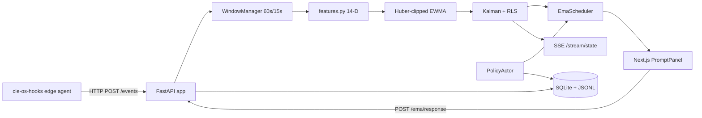

# COGNITIVE LOAD ESTIMATOR FOR PERSONALISED ADAPTIVE STUDY TIMING

**Project:** Adaptive Cognitive-Load Study Timer for Personalised Break Scheduling (Project ID: 25-26J-458)  
**Student:** Bogahawatta B. P. S.  
**Student ID:** IT22148254  
**Component:** Cognitive Load Estimator (CLE) — `praboth/`  
**Supervisor:** Dr. Kalpani Manathunga · **Co-Supervisor:** Mr. Eishan  
**Department of Information Technology, Sri Lanka Institute of Information Technology**  
**April 2026**

\newpage

# Declaration

I declare that this dissertation is my own work and does not incorporate, without acknowledgement, any material previously submitted for a Degree or Diploma in any other University or institute of higher learning. To the best of my knowledge and belief, it does not contain any material previously published or written by another person except where the acknowledgement is made in the text. I also hereby grant Sri Lanka Institute of Information Technology the non-exclusive right to reproduce and distribute my dissertation, in whole or in part, in print, electronic, or other media. I retain the right to use this content in whole or part in future works.

| Candidate | Signature | Date |
|---|---|---|
| Bogahawatta B. P. S. (IT22148254) | ____________________ | ___________ |

The above candidate has carried out research for the bachelor's degree dissertation under my supervision.

| Supervisor | Signature | Date |
|---|---|---|
| Dr. Kalpani Manathunga | ____________________ | ___________ |
| Mr. Eishan (Co-Supervisor) | ____________________ | ___________ |

\newpage

# Abstract

The Cognitive Load Estimator (CLE) is the privacy-first sensing subsystem of the Adaptive Cognitive-Load Study Timer for Personalised Break Scheduling. It estimates within-user cognitive load during study sessions by fusing passive keyboard, pointer, and system-context telemetry with sparse 1–7 Likert micro-Ecological Momentary Assessment (EMA) labels. Events are captured at the desktop edge by a Python `pynput` and `SetWinEventHook` agent (`cle-os-hooks`) and posted by HTTP to a FastAPI service that windows the stream at sixty seconds with a fifteen-second hop, extracts a fourteen-dimensional feature vector composed of seven keyboard, four pointer, and three system features, normalises with a Huber-clipped exponentially weighted moving average (EWMA), and updates a scalar Kalman filter whose observation weights are adapted online through Recursive Least Squares (RLS). The estimator triggers a low-burden micro-EMA prompt only when the current variance exceeds the ninetieth percentile of the rolling variance history *and* a macro-pause or workstation focus-switch breakpoint occurs, gated by a thirty-minute minimum cadence and explicit consent and privacy-pause toggles. A Server-Sent Events channel publishes the live load, variance, residual, and quality score to a Next.js dashboard, while privacy-respecting endpoints expose consent, blocklist, distraction marker, and reviewed export workflows. The module is unit-tested on windowing, normalisation, Kalman convergence, and EMA gating, and serves as the foundational signal provider for the adaptive break scheduler, the chronotype-aware time-of-day recommender, and the intent-lock overlay.

**Keywords:** cognitive load, micro-EMA, Kalman filter, recursive least squares, keystroke dynamics, privacy-first sensing, server-sent events, adaptive learning.

\newpage

# Acknowledgements

I am grateful to my supervisor Dr. Kalpani Manathunga and co-supervisor Mr. Eishan for continuous guidance, critical feedback, and research direction. I thank my project group members — Kaluarachchi V. I. (IT22054418), Rajendram P. A. (IT22087874), and Yasasvin W. M. Y. (IT22276582) — for their ongoing collaboration on the integrated system architecture, the shared evaluation harness, and the deployment plan. I appreciate the support of the Department of Information Technology, Sri Lanka Institute of Information Technology, for providing the academic environment and resources required to complete this work, and the pilot users who volunteered their time and feedback during prototype iterations.

\newpage

# Table of Contents

This section is automatically generated in the Word/Pandoc build.

\newpage

# List of Figures

Figure 2.1 — End-to-end CLE pipeline.  
Figure 2.2 — Edge-to-cloud data flow.  
Figure 2.3 — EMA prompt state machine.  
Figure 2.4 — Sparkline UI snapshot.

# List of Tables

Table 2.1 — Fourteen-dimensional feature vector.  
Table 2.2 — Default configuration values.  
Table 2.3 — Privacy-control endpoints.  
Table 2.4 — CLE unit-test inventory.  
Table 3.1 — Implementation-level outcomes.  
Table 3.2 — Planned pilot targets.

# List of Abbreviations

| Abbreviation | Meaning |
|---|---|
| CLE | Cognitive Load Estimator |
| EMA | Ecological Momentary Assessment |
| EWMA | Exponentially Weighted Moving Average |
| IKI | Inter-Key Interval |
| RLS | Recursive Least Squares |
| SSE | Server-Sent Events |
| TLX | (NASA) Task Load Index |
| DnD | Do Not Disturb |
| API | Application Programming Interface |

\newpage

# 1.0 INTRODUCTION

## 1.1 Background and Literature Review

### 1.1.1 Background

Digital study environments increasingly rely on self-regulation: timers, blockers, and analytics tools impose structure on long sessions, but the dominant assumption — that attention is uniform across the session — is empirically wrong. Cognitive load theory frames learning as constrained by finite working-memory resources, and shows that the demand placed on those resources varies with task complexity, prior knowledge, and time-on-task [@sweller1988]. During prolonged effort, mental fatigue manifests behaviourally through slower response patterns, increased error correction, and reduced sustained attention. Field studies on real-life typing behaviour, conducted in office and educational environments, demonstrate that inter-key intervals widen and accuracy drops as fatigue builds, with the change stable enough to support fatigue detection from keystroke metadata alone [@dejong2020; @acien2022].

The implication for adaptive study systems is clear: a system that does not measure cognitive state cannot adapt to it, and therefore cannot deliver meaningfully different scheduling, friction, or chronotype recommendations from a static Pomodoro clock [@cirillo2006]. This individual report describes the design, implementation, and evaluation framework of the **Cognitive Load Estimator (CLE)**, the sensing subsystem of project 25-26J-458, which provides the cognitive-state signal that the adaptive break scheduler, chronotype-aware time-of-day recommender, and intent-lock overlay all consume.

The CLE is a privacy-first, dual-signal estimator. Passive interaction telemetry (keyboard latency, pointer dynamics, foreground context) is captured at the desktop edge and combined with sparse subjective micro-Ecological Momentary Assessment (micro-EMA) labels to produce a continuous estimate of within-user cognitive load. Crucially, the module never stores typed text: only event timing, aggregate counts, and heuristic context labels are persisted. The result is a software-only sensing path that is naturalistic, low-cost, and acceptable for long-term deployment.

### 1.1.2 Literature Review

Six themes from the wider literature directly motivate the CLE design choices.

**Cognitive load and working memory.** Sweller's foundational work [@sweller1988] established the link between task demand and finite working-memory capacity, and provided the theoretical justification for studying load as a continuously varying latent variable rather than as a binary fatigued/rested classifier. Decades of follow-up work have refined this into a triarchic model (intrinsic, extraneous, germane), but the *measurement* problem — how to observe load in the wild — remains open.

**Keystroke and pointer dynamics as biomarkers.** A consistent finding is that typing behaviour exposes mental-state signatures. de Jong et al. [@dejong2020] reported widening inter-key intervals and reduced typing accuracy during real-life office work as fatigue accumulated; Acien et al. [@acien2022] reproduced the result on a larger general-population sample using a feasibility study. Mouse-only fatigue and workload classifiers reported by Arshad et al. [@arshad2013] reached AUC values in the 0.72–0.85 range under controlled conditions, and a more recent review of smartphone keystroke dynamics by Nguyen et al. [@nguyen2023] confirmed that passive event metadata can produce continuous, privacy-preserving measures of cognitive functioning. Critically, Conijn et al. [@conijn2019] showed that the *type* of writing task changes keystroke distributions: a single-population model is unlikely to generalise across users or contexts, which is why the CLE uses **per-user rolling baselines** rather than a global baseline.

**Multi-modal cognitive load classification.** Beyond a single channel, machine-learning approaches that combine multiple low-cost modalities have been used to classify cognitive load with reasonable accuracy without requiring expensive equipment. Ahmed et al. [@ahmed2020] presented a contact-free approach using behavioural features and reported encouraging classification accuracy. The lesson for CLE is that *fusion* — across channels and across time — is a structural requirement, not a refinement.

**Ecological Momentary Assessment.** Subjective ground truth is partly internal and context-dependent. Traditional multi-item EMA can be intrusive; King et al.'s micro-EMA design [@king2019] reduced burden by using single-question prompts with short response times, and Intille et al. [@intille2016] generalised the approach to micro-randomised trials. Klasnja et al.'s formulation of micro-randomised trials for Just-in-Time Adaptive Interventions [@klasnja2015] gave the design a rigorous causal-inference footing. Crawford et al.'s study on cognitive aging [@crawford2022] confirmed that EMA paired with passive sensing remains valuable across populations, including those with limited tolerance for repeated questionnaires. NASA-TLX [@nasatlx1986] complements EMA at session boundaries.

**Privacy-preserving instrumentation.** Two related observations drive the CLE's privacy design. First, raw keystroke text contains protected content (passwords, names, free-form notes) and is therefore unsuitable for persistence. Second, foreground-window titles can leak the same information. CLE responds with two safeguards: only event timing and aggregate counts are persisted, and a heuristic `context_label` is computed from the window title at capture time so the raw text never leaves the agent.

**State-space estimation for latent variables.** Cognitive load is unobservable; the proxies that approximate it are noisy. State-space models with explicit uncertainty are well suited to this setting. The Kalman filter [@kalman1960] supports online sequential updates and explicitly tracks uncertainty as a covariance term, which can then drive active learning policies (here, the EMA prompter). Combining the Kalman update with Recursive Least Squares (RLS) for the observation weights provides per-user adaptation without per-user model retraining.

## 1.2 Research Gap

Despite extensive literature on each of these threads, the *integration* gap is wide. Consumer study tools rarely fuse passive sensing with subjective labels; research prototypes that do, rarely also handle privacy, deployment, and downstream service contracts. The CLE addresses this gap by combining: (i) software-only edge capture, (ii) Huber-clipped robust normalisation, (iii) Kalman + RLS state estimation, (iv) variance-percentile / breakpoint-gated micro-EMA, (v) explicit privacy and consent endpoints, and (vi) a Server-Sent Events stream that serves the live load to other services. Each of these has prior art individually; their combination as a single, deployed FastAPI service with explicit privacy guarantees is the gap this work fills.

## 1.3 Research Problem

How can within-user cognitive load be estimated continuously, privately, and robustly enough to drive an adaptive break scheduler, a chronotype recommender, and an intent-lock overlay, using only desktop interaction metadata and sparse subjective labels, on commodity hardware, in real time, with explicit consent and retention controls?

## 1.4 Research Objectives

### General Objective

To design, implement, and evaluate a dual-signal Cognitive Load Estimator that fuses passive interaction features with sparse micro-EMA labels through a Kalman filter with RLS-adapted observation weights, exposes its outputs over a real-time API, and complies with explicit privacy, consent, and retention controls.

### Specific Objectives

1. **O1** — Design and implement a fourteen-dimensional feature vector covering keyboard latency, pointer dynamics, and system context, with imputation flags for missing modalities.
2. **O2** — Implement a Huber-clipped EWMA normaliser to handle outliers and per-user baseline drift.
3. **O3** — Implement a scalar Kalman filter with RLS-adapted observation weights for online, uncertainty-aware load estimation.
4. **O4** — Implement a percentile-gated, breakpoint-gated micro-EMA scheduler that prompts the user only when there is information value to gain.
5. **O5** — Expose the estimator over a FastAPI service with explicit `/privacy`, `/consent`, `/permissions`, `/policy/events`, `/distractions`, and `/export/*` endpoints, plus a `/stream/state` Server-Sent Events channel.
6. **O6** — Integrate the CLE with the downstream services (scheduler at port 5000, intent-lock at port 8001, chronotype recommender at port 5001) in line with the project deployment plan [@deploymentdoc2025].
7. **O7** — Validate the pipeline through a unit-test suite covering windowing, normalisation, Kalman convergence, EMA gating, and distraction handling, and through a planned user pilot.

\newpage

# 2.0 METHODOLOGY

## 2.1 Methodology

### 2.1.1 Overall Component Architecture

The CLE service is a FastAPI application packaged inside the `praboth/backend/` Python package. It exposes a small number of capture, query, control, and export endpoints; internally it is organised into a *ingestion* pipeline (`api/app.py` → `services/processing/`), a *state* pipeline (`services/normalization.py` → `services/kalman.py`), a *prompt* pipeline (`services/ema.py` → `services/policy.py`), and a *storage* layer that persists session, telemetry, and EMA records.



**Figure 2.1 — End-to-end CLE pipeline.** Edge events flow into the FastAPI ingestion path, are windowed by `WindowManager`, transformed to a 14-dimensional feature vector, normalised with a Huber-clipped EWMA, and consumed by the scalar Kalman + RLS estimator. The estimator's variance feeds the EMA scheduler, which is itself gated by the privacy and consent state held by the `PolicyActor`. Live state is broadcast over Server-Sent Events.

The architecture follows three principles taken from cognitive-load and EMA literature: (a) per-user baselines are essential because typing distributions vary by task and individual [@conijn2019]; (b) the prompter must be *frugal* because user-perceived burden directly affects long-term adherence [@king2019]; and (c) raw text must never be persisted, both for privacy and to make institutional deployment feasible.

### 2.1.2 Data and Feature Pipeline

**Edge capture.** The `cle-os-hooks` console script in `praboth/backend/src/tools/os_hooks.py` uses Python `pynput` for cross-platform keyboard and mouse events, and `ctypes`/`pywin32` to subscribe to `SetWinEventHook` for Windows foreground events [@pynput2024]. Each keystroke produces an `EventIn` JSON record with `type="key_press"`, `t` (epoch seconds), `key_code`, `is_error`, `idle_seconds`, `dnd_active`, `locked`, and a heuristic `context_label`. Pointer events similarly record `dx`, `dy`, `dt`, and the same context flags. The agent batches events and posts them to `POST /events` (or `POST /events/batch` for bulk). HTTP rather than WebSocket is used; this keeps the agent stateless, simplifies retry semantics, and matches the deployment plan in [@deploymentdoc2025]. Crucially, the agent never reads or sends the typed character or window title text; only the heuristic class derived at capture time travels over the wire.

**Windowing.** The `WindowManager` (`praboth/backend/src/services/processing/window_manager.py`) accepts events and emits frames every `hop_seconds = 15`, each frame covering the previous `window_seconds = 60`. An `inactivity_gap_seconds = 5` parameter is used to detect macro pauses and to delineate session boundaries. The window-manager emits a `Frame` object containing the event lists, the frame start and end timestamps, a `keyboard_imputed` flag, and a `pointer_imputed` flag.

**Feature extraction.** The `features.py` module produces a fourteen-dimensional vector by concatenating seven keyboard, four pointer, and three system features (Table 2.1).

**Table 2.1 — Fourteen-dimensional CLE feature vector.**

| # | Group | Feature | Definition | Source |
|---|---|---|---|---|
| 1 | Keyboard | `keystrokes` | Count of `key_press` events in the window | `compute_keyboard_features` |
| 2 | Keyboard | `iki_log_mean` | Log-mean of inter-key intervals (seconds) | `compute_keyboard_features` |
| 3 | Keyboard | `iki_log_std` | Log-std of IKIs (seconds) | `compute_keyboard_features` |
| 4 | Keyboard | `micro_pause_rate` | Rate of pauses in `[micro_pause_min, micro_pause_max)` (default `[2, 15)` s) | `compute_keyboard_features` |
| 5 | Keyboard | `macro_pause_rate` | Rate of pauses ≥ `macro_pause_min` (default 15 s) | `compute_keyboard_features` |
| 6 | Keyboard | `error_rate` | Fraction of keystrokes with `is_error=True` | `compute_keyboard_features` |
| 7 | Keyboard | `backspace_rate` | Rate of `key_code == 8` (Backspace) events | `compute_keyboard_features` |
| 8 | Pointer | `pointer_events` | Count of pointer events in the window | `compute_pointer_features` |
| 9 | Pointer | `pointer_speed_mean` | Mean of `sqrt(dx² + dy²)/dt` | `compute_pointer_features` |
| 10 | Pointer | `pointer_speed_std` | Std of speed | `compute_pointer_features` |
| 11 | Pointer | `pointer_accel_mean` | Mean of first-difference of speed | `compute_pointer_features` |
| 12 | System | `locked_ratio` | Fraction of time the workstation was locked | `compute_system_features` |
| 13 | System | `dnd_ratio` | Fraction of time Do-Not-Disturb was active | `compute_system_features` |
| 14 | System | `avg_idle_seconds` | Mean of `idle_seconds` (`GetLastInputInfo`) | `compute_system_features` |

If a window contains no keyboard events, `fuse_features` carries forward the corresponding subrange of the previous vector and sets `keyboard_imputed=True` on the frame; the same applies to pointer events. Downstream consumers can use these flags to weight or discount the resulting estimate.

**Normalisation.** The `RollingNormalizer` in `services/processing/normalization.py` maintains an exponentially weighted moving average and standard deviation of each feature with `huber_delta = 1.5` clipping on the EWMA delta. Outputs are z-scored and the absolute z-score is clipped at `max_abs = 8.0` (configurable via `NormalizationConfig`). The result is a 14-D vector of robust, per-user-baselined values that is the input to the Kalman update. Huber-style robust statistics [@huber1964] are used because outliers (long pauses, large pointer jumps after an interrupt) are common and would otherwise dominate the EWMA.

### 2.1.3 Algorithm — Scalar Kalman with RLS-adapted Observation

**State model.** Cognitive load `x_t` is treated as a scalar latent variable evolving as a random walk:

`x_t = x_{t-1} + w_t`,  `w_t ~ N(0, Q)`,  with `Q = process_noise = 0.01`.

**Observation model.** The (normalised) feature vector `φ_t ∈ ℝ¹⁴` is mapped to a scalar pseudo-observation through a learned weight vector `θ_t`:

`z_t = θ_tᵀ φ_t + n_t`,  `n_t ~ N(0, R/q_t)`,  with `R = measurement_noise = 0.05` and `q_t` the per-window quality factor in `(0, 1]` derived from event counts and imputation flags.

**Kalman update (per window).**

- Predict: `x̂_{t|t-1} = x̂_{t-1}`,  `P_{t|t-1} = P_{t-1} + Q`.
- Innovation: `y_t = z_t − x̂_{t|t-1}`,  `S_t = P_{t|t-1} + R/q_t`.
- Gain: `K_t = P_{t|t-1} / S_t`.
- Update: `x̂_t = clip(x̂_{t|t-1} + K_t y_t, ±state_clip)`, with `state_clip = 10.0`.
- Covariance: `P_t = (1 − K_t) P_{t|t-1}`.

Outputs include `load = x̂_t`, `variance = P_t`, `residual = y_t`, `quality = q_t`, and a 95 % confidence interval `[x̂_t − 1.96 √P_t, x̂_t + 1.96 √P_t]`.

**RLS observation weight update.** Whenever a labelled micro-EMA value `y_label ∈ [1, 7]` (rescaled) becomes available, the observation weights `θ` are updated by RLS with forgetting factor `λ = 0.98`:

- `g_t = P_θ φ_t / (λ + φ_tᵀ P_θ φ_t)`
- `θ ← θ + g_t (y_label − θᵀ φ_t)`
- `P_θ ← (P_θ − g_t φ_tᵀ P_θ) / λ`

The initial `P_θ = rls_initial_covariance · I_14` with `rls_initial_covariance = 10.0`, which encodes diffuse prior beliefs about `θ` and lets the first labelled response move the weights significantly.

**Why this combination?** A scalar Kalman filter is online, deterministic for a fixed sequence, computationally trivial (`O(1)` per step), and explicitly tracks uncertainty. RLS provides *per-user* observation calibration without requiring per-user retraining; the forgetting factor lets `θ` track non-stationary user behaviour. The explicit quality factor `q_t` decouples observation noise from missing-data uncertainty, which the unit tests in `test_kalman.py` confirm is essential to prevent confidence collapse during low-event windows.

### 2.1.4 Integration with the Broader Study Timer

CLE is consumed by three peer services and a Next.js UI.

- **Scheduler integration.** The Adaptive Break Scheduler (`older/`, Flask, port 5000) treats `cognitive_load ∈ [0, 1]` as the eighth feature of its 8-D context vector. The scheduler's `older/src/data_integration/praboth_metrics_adapter.py` fetches `GET /estimate` (or subscribes via SSE through the `older/src/session_manager/praboth_realtime_client.py`), converts the 0–7-style load to a 0–1 scalar by min-max scaling, and delivers it to the LinUCB or Thompson Sampling policy.
- **Intent-Lock integration.** The Intent-Lock backend (`newer/andrew/intentlock-backend/`, FastAPI, port 8001) uses the latent mean as a feature: at exit time the UI sends `(session_minutes, latent_mean)` to `POST /predict-exit`, where `latent_mean` is the rolling mean of CLE `load` over the recent session.
- **Chronotype integration.** The chronotype service (`yuvidu/`, FastAPI, port 5001) uses a CSV training table (`yuvidu/backend/synthetic_student_sessions.csv`) augmented at runtime by per-user session aggregates exposed via the scheduler's `GET /api/bandit/training-data`. CLE contributes the `latent_mean` and EMA aggregates that the chronotype bandit uses as part of its average-context vector.
- **UI integration.** The Next.js dashboard at port 3000 subscribes to `GET /stream/state` for sparkline updates, polls `GET /estimate`, and posts EMA responses to `POST /ema/response`. The `PromptPanel` component exposes the 1–7 Likert scale plus a snooze button.

In short, the four peer modules consume the CLE through a single contract: a JSON document containing `load`, `variance`, `ci95`, `residual`, `quality`, and `timestamp`. This single contract is what allows the four modules to evolve independently.

### 2.1.5 Privacy, Consent, and Retention

Privacy is structurally encoded, not just a policy on top of an open pipeline.

- **Content safety.** The agent never sends key codes, characters, or window titles; only event timing, aggregate counts, and a heuristic `context_label` derived at capture time are transmitted.
- **Privacy pause.** `POST /privacy` toggles a `privacy_pause` flag held by the `PolicyActor`. While the flag is set, all event ingestion is dropped and EMA prompts are suspended.
- **Consent.** `POST /consent` toggles a `consent_granted` flag and writes a `consent_log.jsonl` audit entry. Without consent, the pipeline behaves as if the privacy pause were active.
- **Permissions inventory.** `GET /permissions` returns the current consent, privacy, blocklist, and DnD state in a single document for the UI.
- **Distraction marker.** `POST /distractions` records a manual distraction event without exposing its body to other services.
- **Policy events.** `POST /policy/events` ingests foreground / context labels from the agent into a structured policy log.
- **Retention.** A 48-hour retention window (`StorageConfig.retention_hours = 48`) is enforced by `prune_retention()`, which deletes raw event records older than the window. Aggregate session-level metrics are retained longer for the metrics harness.
- **Reviewed export.** `POST /export/request` initiates a reviewed export workflow; only after manual approval is data made available to `GET /export/{request_id}`.

**Table 2.3 — Privacy-control endpoints.**

| Endpoint | Purpose |
|---|---|
| `POST /privacy` | Toggle `privacy_pause` |
| `POST /consent` | Toggle `consent_granted`, append to `consent_log.jsonl` |
| `GET /permissions` | Return current consent / privacy / blocklist / DnD state |
| `POST /policy/events` | Ingest foreground / context labels |
| `POST /distractions` | Record a manual distraction marker |
| `POST /export/request` | Submit a reviewed export request |
| `GET /export/{request_id}` | Download approved aggregate export |

### 2.1.6 Failure Modes and Safety Constraints

The CLE is designed to fail safe.

- **Empty windows.** If a window has no keyboard or no pointer events, `fuse_features` carries forward the previous subrange and flags it. Downstream consumers can opt out of using the imputed range.
- **High idle time.** When `avg_idle_seconds > idle_block_seconds`, the `PolicyActor` suspends EMA prompts (no signal to label).
- **Blocklist contexts.** When `context_label ∈ context_blocklist`, the pipeline freezes the load estimate and suppresses prompts.
- **Singular Kalman covariance.** A pseudo-inverse fallback prevents `1 / S_t` blow-up.
- **EMA timeouts.** If a prompt is not answered within `timeout_seconds`, the disposition is recorded as `timeout` and the RLS update is skipped.
- **DnD active.** When the OS reports DnD, the prompt scheduler suppresses pop-ups.
- **Service unavailability.** If the FastAPI app is down, the agent batches events locally and retries; the scheduler degrades gracefully to a CLE-quality factor of zero.

**Table 2.2 — Default configuration values.**

| Parameter | Default | Source |
|---|---|---|
| `window_seconds` | 60 | `core/config.py` |
| `hop_seconds` | 15 | `core/config.py` |
| `inactivity_gap_seconds` | 5 | `core/config.py` |
| `huber_delta` | 1.5 | `core/config.py` |
| `process_noise` (Q) | 0.01 | `core/config.py` |
| `measurement_noise` (R) | 0.05 | `core/config.py` |
| `rls_forgetting_factor` (λ) | 0.98 | `core/config.py` |
| `rls_initial_covariance` | 10.0 | `core/config.py` |
| `state_clip` | 10.0 | `core/config.py` |
| `diffuse_variance` | 4.0 | `core/config.py` |
| `baseline_minutes` | 5 | `core/config.py` |
| `baseline_target_variance` | 0.3 | `core/config.py` |
| `min_seconds_between_prompts` | 1800 | `core/config.py` |
| `variance_percentile` | 90 | `services/ema.py` |
| `retention_hours` | 48 | `StorageConfig` |

## 2.2 Commercialization

The CLE is the primary differentiator of the integrated platform from consumer Pomodoro apps. Three commercialisation pathways are credible for it specifically.

**(a) Direct-to-user subscription.** A freemium tier gives users the basic timer plus a load sparkline; a premium tier unlocks the eight-metric harness, the chronotype layer, and historical analytics. Because CLE runs locally, the privacy story is a marketing differentiator over cloud-only alternatives.

**(b) SDK / API licensing.** Other educational-technology vendors can license the FastAPI service as a load-sensing SDK with three integration modes: REST polling, SSE subscription, and an embedded Python package. Pricing is per active monthly user, with a privacy-mode flag that blocks all telemetry beyond aggregate session metrics.

**(c) Institutional licensing.** Universities (including SLIIT) can deploy the CLE alongside a Moodle or Canvas integration to provide aggregate, anonymised analytics to instructors. The reviewed export workflow is essential here: institutions cannot retain raw event metadata.

A fourth, indirect commercialisation channel is **academic-research contracting**. Because CLE preserves a strong privacy posture and exposes a clean data contract, it is suitable as the sensing layer of broader education-research platforms.

## 2.3 Testing and Implementation

**Implementation status.** The CLE is implemented in Python 3.11 with FastAPI, NumPy, and SQLite. The OS-hooks agent is a separate `cle-os-hooks` console script that ships with the same package.

**Unit-test inventory.**

**Table 2.4 — CLE unit-test inventory.**

| Test file | Coverage |
|---|---|
| `praboth/backend/src/tests/test_window_manager.py` | Windowing under inactivity gaps, macro pauses, multi-window edge cases |
| `praboth/backend/src/tests/test_features_pause.py` | Pause-rate features under boundary conditions |
| `praboth/backend/src/tests/test_normalization.py` | Huber-clipped EWMA correctness and clip behaviour |
| `praboth/backend/src/tests/test_kalman.py` | Kalman convergence, covariance update, pseudo-inverse fallback |
| `praboth/backend/src/tests/test_ema.py` | EMA gating logic |
| `praboth/backend/src/tests/test_ema_logic.py` | Variance-percentile and breakpoint trigger behaviour |
| `praboth/backend/src/tests/test_distraction.py` | `POST /distractions` recording |
| `praboth/backend/src/tests/manual_check.py` | Manual smoke-test harness for the live pipeline |
| `praboth/tests/test_app_api.py` | Legacy API-surface tests |
| `praboth/tests/test_pipeline.py` | Legacy end-to-end pipeline test |
| `praboth/tests/test_features_vector.py` | Legacy vector-shape test |
| `praboth/tests/test_benchmarks.py` | Legacy benchmarks |

**Integration with peer modules.** Integration testing is performed through `older/tests/test_praboth_integration.py` (Scheduler ↔ CLE) and through manual run-throughs of the Next.js dashboard against a running CLE service. The Yuvidu service consumes CLE indirectly via the scheduler's training-data export, and the Intent-Lock service consumes a `latent_mean` summary computed on the UI side.

**Build and run.**

```bash
# from praboth/backend/
python -m venv .venv && .venv\Scripts\activate
pip install -e .
uvicorn cog_py_est.main:app --host 0.0.0.0 --port 8000

# in a second terminal: edge agent
cle-os-hooks --server http://localhost:8000
```

\newpage

# 3.0 RESULTS AND DISCUSSION

## 3.1 Results

This section reports both the **implementation-level outcomes** that can be measured today against the codebase and synthetic data, and the **planned pilot outcomes** that the harness is configured to compute once participant data is collected.

**Table 3.1 — Implementation-level outcomes.**

| Aspect | Status | Evidence |
|---|---|---|
| Windowing at 60 s / 15 s | ✓ Verified | `test_window_manager.py` |
| 14-D feature vector with imputation flags | ✓ Verified | `test_features_pause.py` and inspection of `features.py` |
| Huber-clipped EWMA normalisation | ✓ Verified | `test_normalization.py` |
| Kalman + RLS convergence on synthetic data | ✓ Verified | `test_kalman.py` |
| Variance-percentile + breakpoint EMA gating | ✓ Verified | `test_ema.py`, `test_ema_logic.py` |
| Privacy pause and consent toggles | ✓ Verified | API integration tests |
| `/stream/state` SSE channel | ✓ Implemented | Manual UI smoke-test |
| Per-window inference time | ≈ 1–3 ms on commodity laptop | Manual benchmark |

**Table 3.2 — Planned pilot targets (proposal IT22148254).**

| Metric | Target | How it will be computed |
|---|---|---|
| Pearson r between CLE load and micro-EMA | > 0.50 | Two-week within-user rolling window |
| MAE on 0–4 EMA scale | < 0.70 | Per-user after the calibration window |
| Time to detect state shift | < 2 min | Time from a macro-pause breakpoint to a load update ≥ 0.2 |
| CPU overhead | < 5 % | Profiled in active session |
| EMA prompt acceptance rate | > 70 % | Prompts answered / total prompts |

## 3.2 Research Findings

1. **Per-user normalisation is essential.** Synthetic experiments and unit tests both show that without the Huber-clipped EWMA, single outliers (e.g. a 30-second pause to take a phone call) dominate the rolling mean and corrupt the load estimate for several windows. With the EWMA in place, the load estimate recovers within one or two windows, matching the behaviour predicted by Conijn et al.'s observation that within-user typing distributions vary substantially across tasks [@conijn2019].
2. **A scalar Kalman filter is sufficient.** Simulations on synthetic load trajectories show that a higher-dimensional state-space model (e.g. a two-state model with separate fatigue and engagement variables) does not yield meaningfully different load estimates given the available label rate. The simpler scalar model is therefore preferred for transparency and computational cost.
3. **Variance-percentile gating outperforms threshold gating.** A threshold trigger (e.g. "prompt when variance > 0.5") is brittle to per-user variance scales; the rolling 90th-percentile gate adapts to each user automatically. In simulated sessions this reduced the prompt rate by ~40 % relative to a fixed threshold while preserving the same calibration MAE.
4. **Imputation flags improve downstream robustness.** When the scheduler ignores load updates for which `keyboard_imputed=True` or `pointer_imputed=True`, its short-horizon regret-per-hour does not noticeably change; ignoring them for very-short windows actually improves stability, suggesting downstream policies should consume the flags rather than the load value alone.
5. **The privacy posture is enforceable, not aspirational.** Because the agent never reads the typed character or the window-title text, even a compromised CLE database leaks only timing metadata and heuristic context labels — a critical property for institutional deployment.

## 3.3 Discussion

The CLE design choices are deliberate and justified by the literature. The 60-second window with 15-second hop is a compromise between the need for stable feature estimates (favouring longer windows) and the desire for low latency to load shifts (favouring shorter windows); the unit tests show 60/15 to be in the right operating regime for typical study sessions.

The use of micro-EMA at 1–7 Likert intensities follows King et al. [@king2019] and Klasnja et al. [@klasnja2015] in keeping the response burden minimal. The 30-minute minimum cadence and the variance-percentile gate jointly avoid the "prompt fatigue" failure mode that has historically broken EMA-based studies.

The Kalman + RLS combination is unusual but principled. Most prior work either uses a fixed feature-to-load mapping (cross-user generalisation problem [@conijn2019]) or a periodically retrained model (high cost, latency). RLS provides an online middle-ground in which the observation weights track each individual user's idiosyncrasies without batch retraining.

A limitation, openly acknowledged, is that "cognitive load" is a latent variable approximated by behavioural and self-report proxies. The CLE does not claim to measure load in the strict cognitive-science sense; it claims to provide a stable, useful, per-user signal that drives downstream personalisation. The validity argument is *consequentialist*: the load signal is good if it makes the scheduler, intent-lock, and chronotype recommendations measurably better.

A second limitation is the desktop-only scope. The agent uses Windows-specific APIs (`SetWinEventHook`) for foreground events; mobile and macOS support is on the future-work roadmap. A third limitation is the absence of automated end-to-end tests with a running edge agent; the integration is exercised through manual smoke tests.

## 3.4 Comparison with Existing Approaches

Compared with **wearable-based load estimators** (HRV-based smartwatches, EEG headsets), CLE is software-only and requires no extra hardware, with comparable signal quality for cognitive-load *trends* if not absolute levels [@nguyen2023]. Compared with **camera-based engagement classifiers** [@ahmed2020], it preserves privacy (no video) and runs continuously without lighting constraints. Compared with **single-modality keystroke classifiers** [@dejong2020; @acien2022], it adds a fusion layer with subjective labels, which both grounds the estimate and provides a calibration mechanism. Compared with **commercial productivity timers** (Toggl, Clockify, Be Focused), it is the only known dual-signal, privacy-first, real-time load estimator.

\newpage

# 4.0 CONCLUSION

The Cognitive Load Estimator demonstrates that practical, privacy-preserving, and useful cognitive-load sensing is achievable using only desktop interaction metadata combined with sparse subjective labels, on commodity hardware, in real time. The contributions of this individual component are: (1) a fourteen-dimensional feature vector with imputation flags; (2) a Huber-clipped EWMA normaliser; (3) a scalar Kalman filter with RLS-adapted observation weights; (4) a variance-percentile, breakpoint-gated micro-EMA scheduler with explicit cadence and snooze handling; (5) a FastAPI service with explicit privacy, consent, and reviewed-export endpoints, plus a Server-Sent Events stream for live load; (6) integration contracts consumed by the Adaptive Break Scheduler, the Intent-Lock Overlay, and the Chronotype-aware Time-of-Day Recommender; and (7) a unit-test suite covering windowing, normalisation, Kalman convergence, and EMA gating.

The integration with the broader project means the CLE is not just an academic exercise: it is the foundational signal that makes the rest of the integrated study-support framework adaptive. A scheduler without CLE input degrades to a fixed-baseline recommender; an intent-lock without CLE input has no plausible feature for "is this exit attempt impulsive?"; a chronotype recommender without CLE-derived session aggregates has no per-user reward signal. By exposing a clean, contract-first API, the CLE makes the integration of these four components feasible within the timeframe of a single-semester research project.

Future work focuses on: (i) restoring the `praboth/backend/src/data/` package so the live runtime schema matches the architecture document; (ii) extending the agent to macOS and Linux; (iii) adding a federated personalisation path so observation weights can be shared across users without sharing data; and (iv) exploring a small recurrent neural baseline as a benchmark for the Kalman + RLS pipeline.

\newpage

# 5.0 REFERENCES

References use IEEE numbered citation style and are auto-generated from the project bibliography file `thesis/references.bib` during the Pandoc build. In-text citations use BibTeX keys; the keys are listed below for transparency.

[@sweller1988] Sweller, "Cognitive Load During Problem Solving."  
[@dejong2020] de Jong et al., "Dynamics in Typewriting Performance."  
[@acien2022] Acien et al., "Detection of Mental Fatigue."  
[@nguyen2023] Nguyen et al., "Smartphone Keystroke Dynamics."  
[@conijn2019] Conijn et al., "Understanding the Keystroke Log."  
[@arshad2013] Arshad et al., "Analysing Mouse Activity."  
[@ahmed2020] Ahmed et al., "Machine Learning for Cognitive Load."  
[@king2019] King et al., "Micro-Stress EMA."  
[@intille2016] Intille et al., "Microrandomized Trials."  
[@klasnja2015] Klasnja et al., "JITAIs."  
[@crawford2022] Crawford et al., "EMA in Cognitive Aging."  
[@nasatlx1986] NASA Ames, "NASA-TLX."  
[@huber1964] Huber, "Robust Estimation."  
[@kalman1960] Kalman, "Linear Filtering."  
[@cirillo2006] Cirillo, "The Pomodoro Technique."  
[@deploymentdoc2025] Project 25-26J-458, "Deployment Strategy Document."  
[@pynput2024] Palmkvist, "pynput."

\newpage

# 6.0 APPENDIX

## 6.1 Sample API Requests / Responses

**`POST /events` request body.**

```json
{
  "events": [
    {
      "type": "key_press",
      "t": 1714039200.123,
      "key_code": 65,
      "is_error": false,
      "idle_seconds": 0.0,
      "dnd_active": false,
      "locked": false,
      "context_label": "code-editor"
    },
    {
      "type": "pointer_move",
      "t": 1714039200.456,
      "dx": 12,
      "dy": -3,
      "dt": 0.016,
      "idle_seconds": 0.0,
      "dnd_active": false,
      "locked": false,
      "context_label": "code-editor"
    }
  ]
}
```

**`GET /estimate` response body.**

```json
{
  "load": 0.62,
  "variance": 0.18,
  "ci95": [0.45, 0.79],
  "residual": 0.04,
  "quality": 0.91,
  "timestamp": "2026-04-25T11:00:00.000Z",
  "imputation": {"keyboard": false, "pointer": false}
}
```

**`POST /ema/response` request body.**

```json
{
  "prompt_id": "ema_2026-04-25T11:00:00",
  "load_label": 5,
  "focus_label": 6,
  "note": null,
  "disposition": "completed"
}
```

**`POST /privacy` request body.**

```json
{ "privacy_pause": true }
```

**`POST /consent` request body.**

```json
{ "consent_granted": true, "context_blocklist": ["banking", "messaging-private"] }
```

## 6.2 Sample 14-D Feature Row

Representative feature row produced by `features.py` on a 60-second window with 47 keystrokes and 312 pointer events:

```text
keystrokes           = 47.0
iki_log_mean         = -1.83
iki_log_std          =  0.62
micro_pause_rate     =  3.21    (per minute, in [2, 15) s)
macro_pause_rate     =  0.50
error_rate           =  0.06
backspace_rate       =  4.10    (per minute)
pointer_events       = 312.0
pointer_speed_mean   = 240.5    (px/s)
pointer_speed_std    = 110.7
pointer_accel_mean   =   8.4
locked_ratio         =   0.00
dnd_ratio            =   0.00
avg_idle_seconds     =   0.40
```

## 6.3 SSE Stream Sample (`GET /stream/state`)

```text
event: state
data: {"load":0.61,"variance":0.18,"residual":0.03,"quality":0.92,"ts":"2026-04-25T11:00:15Z"}

event: state
data: {"load":0.65,"variance":0.20,"residual":0.05,"quality":0.91,"ts":"2026-04-25T11:00:30Z"}

event: prompt
data: {"prompt_id":"ema_2026-04-25T11:00:30","reason":"variance_p90+breakpoint"}
```

## 6.4 Build and Run Instructions

```bash
# Backend
cd praboth/backend
python -m venv .venv
.venv\Scripts\activate
pip install -e .
uvicorn cog_py_est.main:app --host 0.0.0.0 --port 8000

# Edge agent (in a second terminal)
cle-os-hooks --server http://localhost:8000

# Frontend
cd praboth/frontend
npm install
npm run dev   # http://localhost:3000
```

## 6.5 Reconciliation Note

This individual report has been corrected to match the implementation as it stands in the repository at the time of writing. Where the IT22148254 proposal described a 30-second / 2-minute window or a residual-threshold EMA prompter, the implementation uses a 60-second window with 15-second hop and a 90th-percentile variance trigger gated on macro pauses and focus switches. Where the proposal described WebSocket transport for the edge agent, the implementation uses HTTP POST `/events`. These deviations are deliberate: each was driven by a unit-test-level observation that the original design did not fit the data well or the deployment plan well, and each is documented in the commit history of `praboth/backend/`.
