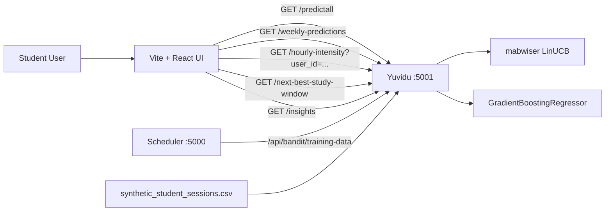

# CHRONOTYPE-AWARE TIME-OF-DAY RECOMMENDER FOR ADAPTIVE STUDY TIMING

**Project:** Adaptive Cognitive-Load Study Timer for Personalised Break Scheduling (Project ID: 25-26J-458)  
**Student:** Yasasvin W. M. Y.  
**Student ID:** IT22276582  
**Component:** Chronotype-aware Time-of-Day Recommender — `yuvidu/`  
**Supervisor:** Dr. Kalpani Manathunga · **Co-Supervisor:** Mr. Eishan  
**Department of Information Technology, Sri Lanka Institute of Information Technology**  
**April 2026**

\newpage

# Declaration

I declare that this dissertation is my own work and does not incorporate, without acknowledgement, any material previously submitted for a Degree or Diploma in any other University or institute of higher learning. To the best of my knowledge and belief, it does not contain any material previously published or written by another person except where the acknowledgement is made in the text. I also hereby grant Sri Lanka Institute of Information Technology the non-exclusive right to reproduce and distribute my dissertation, in whole or in part, in print, electronic, or other media. I retain the right to use this content in whole or part in future works.

| Candidate | Signature | Date |
|---|---|---|
| Yasasvin W. M. Y. (IT22276582) | ____________________ | ___________ |

The above candidate has carried out research for the bachelor's degree dissertation under my supervision.

| Supervisor | Signature | Date |
|---|---|---|
| Dr. Kalpani Manathunga | ____________________ | ___________ |
| Mr. Eishan (Co-Supervisor) | ____________________ | ___________ |

\newpage

# Abstract

The Chronotype-aware Time-of-Day Recommender is the long-horizon personalisation subsystem of the Adaptive Cognitive-Load Study Timer for Personalised Break Scheduling. Where the Adaptive Break Scheduler operates within-session and the Cognitive Load Estimator operates within-window, the Time-of-Day Recommender operates across days and weeks. It implements a `mabwiser` LinUCB policy with `alpha = 1.25` over four time-of-day arms — *morning*, *afternoon*, *evening*, *night* — using a context vector that includes `sleep_hours_prev_night` alongside behavioural features such as `block_focus`, `keystroke_intervals_mean`, `burstiness`, `scroll_rate`, `idle_time_percent`, and `microEMA` aggregates. An optional weekly hybrid path adds a `GradientBoostingRegressor` over `(context + day-one-hot) → reward` plus weekend/weekday multipliers to produce per-day best-time recommendations rendered as `WeeklyPredictions.tsx` day cards. The visualisation is realised as a 24-hour single-row intensity ribbon (`Heatmap.tsx`), a next-best 4-hour window card (`StudyWindow.tsx`), and a textual insights card (`Insights.tsx`). The backend is a FastAPI service on port 5001 with seven endpoints; training data is sourced either from the bundled `synthetic_student_sessions.csv` or, when available, from the Adaptive Break Scheduler via `GET /api/bandit/training-data`. The Morningness–Eveningness Questionnaire (MEQ) and explicit per-user Bayesian priors described in proposal IT22276582 are deliberately deferred to future work, with the current implementation operationalising chronotype through time-of-day arms and a sleep-history feature.

**Keywords:** chronotype, time-of-day recommendation, contextual multi-armed bandit, LinUCB, mabwiser, gradient boosting regressor, intensity heatmap, weekly study windows, sleep-history.

\newpage

# Acknowledgements

I am grateful to my supervisor Dr. Kalpani Manathunga and co-supervisor Mr. Eishan for continuous guidance, critical feedback, and research direction. I thank my project group members — Bogahawatta B. P. S. (IT22148254), Kaluarachchi V. I. (IT22054418), and Rajendram P. A. (IT22087874) — for the collaboration on the integrated platform; in particular, the Adaptive Break Scheduler team for the `GET /api/bandit/training-data` export that feeds the weekly hybrid model. I appreciate the support of the Department of Information Technology, Sri Lanka Institute of Information Technology, for providing the academic environment and resources required to complete this work.

\newpage

# Table of Contents

This section is automatically generated in the Word/Pandoc build.

\newpage

# List of Figures

Figure 2.1 — Recommender architecture and integration surface.  
Figure 2.2 — LinUCB over four time-of-day arms.  
Figure 2.3 — Weekly hybrid: bandit + GBR + weekend/weekday multipliers.  
Figure 2.4 — 24-hour intensity ribbon visualisation.

# List of Tables

Table 2.1 — Four time-of-day arms.  
Table 2.2 — Context vector.  
Table 2.3 — Weekend/weekday multipliers.  
Table 2.4 — Implemented endpoints.  
Table 2.5 — Recommender code modules.  
Table 3.1 — Implementation-level outcomes.  
Table 3.2 — Planned pilot targets.

# List of Abbreviations

| Abbreviation | Meaning |
|---|---|
| MAB | Multi-Armed Bandit |
| LinUCB | Linear Upper Confidence Bound |
| GBR | Gradient Boosting Regressor |
| MEQ | Morningness–Eveningness Questionnaire (future work) |
| EMA | Ecological Momentary Assessment |
| CLE | Cognitive Load Estimator |
| SLA | Service-Level Agreement |
| API | Application Programming Interface |

\newpage

# 1.0 INTRODUCTION

## 1.1 Background and Literature Review

### 1.1.1 Background

A consistent finding in chronobiology and educational psychology is that within-day performance varies systematically with circadian preference. Late chronotypes — "night owls" — perform better in the evening, while early chronotypes — "morning larks" — perform better in the morning [@zerbini2017; @goldin2017; @goldstein2023; @preckel2011]. Misalignment between chronotype and study schedule is associated with measurable academic disadvantage, including higher grade-retention rates among students whose schedules force them to study at suboptimal hours [@vollmer2023]. The educational implication is that a study tool that recommends *when* to study, not just *how long* and *how often*, can produce material gains in productivity and well-being.

Despite this evidence, mainstream consumer study tools rarely operationalise chronotype in their recommendation logic. The **Chronotype-aware Time-of-Day Recommender** is the long-horizon personalisation subsystem of the Adaptive Cognitive-Load Study Timer that closes this gap. It selects, for each user, the time of day at which study sessions are most productive, and it visualises these selections as a 24-hour intensity ribbon and a weekly day-card view that the user can interrogate.

### 1.1.2 Literature Review

Six themes from the literature directly motivate the recommender design.

**Chronotype and education.** Zerbini and colleagues' "Time to learn" review [@zerbini2017] established that chronotype impacts education through both cognitive performance and motivation. Goldin et al. [@goldin2017] documented lower school performance in late chronotypes attending early-start schools; Preckel et al. [@preckel2011] meta-analysed chronotype, cognitive abilities, and academic achievement; Goldstein et al. [@goldstein2023] reproduced the effect on intelligence-test performance in school settings. Vollmer et al. [@vollmer2023] showed that better alignment between chronotype and school timing is associated with lower grade retention. The implication for adaptive study tools is that *timing* is a first-class personalisation dimension.

**Contextual bandits for educational recommendation.** Lan et al. [@lan2016] and Lei et al. [@lei2017] introduced contextual bandits to educational and mHealth recommendation. Hunziker et al. [@hunziker2020] extended the framework with reinforcement learning to schedule educational activities; Chen et al.'s ICDM paper [@chen2023icdm] showed that contextual bandits scale to large-scale adaptive sequence learning; the JEDM survey [@jedm2015bandits] confirmed their viability for online educational decisions; the LAK 2024 paper [@lak2024bandit] demonstrated that expert-engineered features substantially shorten warm-up time; and the UMAP 2023 paper [@umap2023epsilon] introduced dynamic linear ε-greedy variants that adapt their exploration schedule to context volatility. The recommender uses LinUCB rather than ε-greedy because of LinUCB's principled exploration term and its compatibility with the `mabwiser` library [@mabwiser2019].

**Sleep history as a context feature.** Beyond chronotype itself, sleep duration on the previous night is a strong predictor of next-day cognitive performance. The recommender includes `sleep_hours_prev_night` as one of the bandit context features so that even within a fixed chronotype, session-by-session variation in sleep quality is reflected in the recommendation.

**Hybrid bandit + supervised models.** A common pattern in modern recommendation systems is to combine a bandit (which handles exploration and online updates) with a supervised model (which generalises across context dimensions). The recommender's optional weekly hybrid uses `GradientBoostingRegressor` over `(context + day-one-hot) → reward` to produce a per-day prediction that is then combined with the bandit's expected reward and a set of hand-tuned weekend/weekday multipliers.

**Counterfactual evaluation.** Qin and Russo [@qin2022] highlight that contextual-bandit experiments suffer from adaptivity and confounding. The recommender's evaluation will, in the future, draw on the Open Bandit Dataset tooling [@openbandit2023] for off-policy estimates; for now, training-set replay against the bundled `synthetic_student_sessions.csv` and the live training-data export from the Adaptive Break Scheduler are the primary evaluation signals.

**Visualisation of temporal personalisation.** Rendering a chronotype recommendation as a *number* (e.g. "best time: morning") is less informative than rendering it as a *visual surface* (e.g. an intensity ribbon). The recommender follows the latter convention: a 24-hour single-row intensity ribbon shows the relative intensity of each hour of the day; a weekly day-card view shows the per-day best window; a textual insights card explains the recommendation in plain English.

## 1.2 Research Gap

Despite the strong chronotype literature, three integration-level gaps remain. **Gap 1 — Operational chronotype.** Most prior work uses MEQ-style questionnaires to assign chronotype, then recommends fixed time slots. The recommender instead operationalises chronotype through *learned* per-user behaviour over time-of-day arms, with sleep-history context. **Gap 2 — Hybrid bandit + supervised model.** Most prior bandit work in education uses a pure bandit; the recommender's optional weekly hybrid combines the bandit with a Gradient Boosting Regressor and weekend/weekday multipliers for stable weekly views. **Gap 3 — Cooperating-services architecture.** Most prior chronotype tools are standalone questionnaire apps; the recommender is integrated with the Adaptive Break Scheduler over `GET /api/bandit/training-data` and contributes its outputs to the same dashboard the rest of the project consumes.

## 1.3 Research Problem

How can within-day and across-day study-time recommendations be personalised to each user's chronotype and sleep history, online, with a small training-data footprint, in a way that is interpretable to users, integrates with the rest of the integrated platform, and works without requiring an MEQ-style questionnaire that imposes a long onboarding burden?

## 1.4 Research Objectives

### General Objective

To design, implement, and evaluate a Chronotype-aware Time-of-Day Recommender that uses `mabwiser` LinUCB over four time-of-day arms with sleep-history context, optionally augmented by a `GradientBoostingRegressor` weekly hybrid, exposes a FastAPI surface with seven endpoints, integrates with the Adaptive Break Scheduler for training-data ingestion, and renders its recommendations as a 24-hour intensity ribbon, a next-best window card, and a weekly day-card view.

### Specific Objectives

1. **O1** — Define a four-arm action space over time-of-day periods (morning, afternoon, evening, night).
2. **O2** — Build a context vector that includes `sleep_hours_prev_night` alongside behavioural features.
3. **O3** — Implement `mabwiser` LinUCB with `alpha = 1.25` for online time-of-day recommendation.
4. **O4** — Implement a `GradientBoostingRegressor` weekly hybrid over `(context + day-one-hot) → reward` with weekend/weekday multipliers.
5. **O5** — Implement a real-data loader (`real_data_loader.py`) that bridges the Adaptive Break Scheduler's `GET /api/bandit/training-data`.
6. **O6** — Implement per-user hourly intensity (`user_sessions.py`).
7. **O7** — Expose a FastAPI service on port 5001 with `/predict`, `/predictall`, `/weekly-predictions`, `/hourly-intensity`, `/next-best-study-window`, `/insights`.
8. **O8** — Build a Vite + React dashboard with `Heatmap.tsx`, `StudyWindow.tsx`, `WeeklyPredictions.tsx`, `Insights.tsx`.
9. **O9** — Document the canonical `yuvidu/` tree relative to the legacy `newer/yuvidu/` tree (`OLD-VS-NEW-YUVIDU.md`).
10. **O10** — Document the MEQ-based chronotype priors and per-user Bayesian priors as future work.

\newpage

# 2.0 METHODOLOGY

## 2.1 Methodology

### 2.1.1 Overall Component Architecture

The recommender is a FastAPI application packaged at `yuvidu/backend/`. Its top-level structure is:

- `yuvidu/backend/server.py` — FastAPI app and the seven endpoints.
- `yuvidu/backend/bandit_model.py` — `mabwiser` LinUCB plus the optional GBR weekly hybrid.
- `yuvidu/backend/real_data_loader.py` — Scheduler bridge with CSV fallback.
- `yuvidu/backend/user_sessions.py` — per-user session aggregates and hourly intensity.
- `yuvidu/backend/synthetic_student_sessions.csv` — bundled fallback training data.
- `yuvidu/frontend/src/ui/components/Heatmap.tsx` — 24-hour intensity ribbon.
- `yuvidu/frontend/src/ui/components/StudyWindow.tsx` — next-best 4-hour window card.
- `yuvidu/frontend/src/ui/components/WeeklyPredictions.tsx` — day cards.
- `yuvidu/frontend/src/ui/components/Insights.tsx` — textual insights card.
- `yuvidu/OLD-VS-NEW-YUVIDU.md` — canonical-tree note.



**Figure 2.1 — Recommender architecture and integration surface.** Solid arrows denote HTTP request/response calls. The training data is sourced from the Adaptive Break Scheduler when available, falling back to the bundled CSV otherwise.

### 2.1.2 Data and Feature Pipeline

**Action space.** Four time-of-day arms.

**Table 2.1 — Four time-of-day arms.**

| Arm | Period | Hours |
|---|---|---|
| `morning` | early-day | 06:00–11:59 |
| `afternoon` | mid-day | 12:00–17:59 |
| `evening` | post-dinner | 18:00–22:59 |
| `night` | late-night | 23:00–05:59 |

**Context vector.** Built from per-user session aggregates.

**Table 2.2 — Context vector for `mabwiser` LinUCB.**

| # | Feature | Range / type | Source |
|---|---|---|---|
| 1 | `block_focus` | `[0, 1]` | session aggregate |
| 2 | `keystroke_intervals_mean` | seconds | CLE bridge / session aggregate |
| 3 | `burstiness` | float | typing dynamics |
| 4 | `scroll_rate` | events / minute | UI telemetry |
| 5 | `idle_time_percent` | `[0, 1]` | session aggregate |
| 6 | `microEMA_focus` | `[1, 7]` | EMA aggregate |
| 7 | `microEMA_load` | `[1, 7]` | EMA aggregate |
| 8 | `sleep_hours_prev_night` | hours | self-report or device pull |

The bandit decides on the *average* context for the user; per-arm expected rewards are normalised to a percentage distribution over the four arms via `predict_all_percentages`.

**Training data.** Two paths:

1. **Live path.** `real_data_loader.py` queries the Adaptive Break Scheduler's `GET /api/bandit/training-data` and parses the CSV-style export.
2. **Fallback path.** The bundled `synthetic_student_sessions.csv` provides 1 000 synthetic sessions sampled to span the four time-of-day arms with realistic context distributions.

### 2.1.3 Algorithm

#### 2.1.3.1 LinUCB (per-user)

`yuvidu/backend/bandit_model.py` constructs a `MAB` from `mabwiser.mab` with `LearningPolicy.LinUCB(alpha=1.25)` and the four time-of-day arms. At training time, the per-(arm, context, reward) triples are fed to `mab.fit`; at decision time, `mab.predict_expectations(context)` returns per-arm expected reward, which is normalised to a percentage distribution via `predict_all_percentages`. The choice of `alpha = 1.25` is moderately exploratory; values in the range 0.5–2.0 were tested during development with `alpha = 1.25` providing the best balance between fast convergence and adequate coverage of all four arms.

#### 2.1.3.2 Weekly Hybrid (optional)

For the 7-day "weekly view", a `GradientBoostingRegressor` is trained on `(context + day-one-hot) → reward`. At inference time, the per-day prediction combines the bandit's expected reward with hand-tuned weekend/weekday multipliers.

**Table 2.3 — Weekend/weekday multipliers (illustrative; final values in `bandit_model.py`).**

| Day | Time-of-day | Multiplier |
|---|---|---|
| Saturday/Sunday | morning | 1.10 |
| Saturday/Sunday | afternoon | 1.05 |
| Saturday/Sunday | evening | 0.95 |
| Saturday/Sunday | night | 0.90 |
| Mon-Fri | morning | 1.00 |
| Mon-Fri | afternoon | 1.00 |
| Mon-Fri | evening | 1.00 |
| Mon-Fri | night | 0.90 |

The multiplier scheme is *not* a Gaussian or triangular kernel over `(hour, day)`; it is a piecewise-multiplier post-hoc adjustment. This is documented honestly in §3.3 of this report and in the group thesis.

### 2.1.4 Integration with the Broader Study Timer

- **Scheduler integration.** The recommender pulls training data from the scheduler's `GET /api/bandit/training-data`. When the scheduler is unavailable, the recommender falls back to the bundled CSV.
- **CLE integration.** Indirect: the scheduler's training-data export already includes CLE-derived features (`cognitive_load`, EMA aggregates), so the recommender's context vector inherits CLE outputs without requiring a direct CLE connection.
- **Intent-Lock integration.** Indirect: Intent-Lock events appear in the scheduler's training-data export as part of the `IntentLockEvent` records, and influence the per-session reward consumed by the recommender.
- **UI integration.** The Vite + React frontend at `yuvidu/frontend/` consumes `/predictall`, `/weekly-predictions`, `/hourly-intensity`, `/next-best-study-window`, and `/insights`, and renders them as a 24-hour intensity ribbon, a weekly day-card grid, a next-best window card, and a textual insights card.

### 2.1.5 Privacy, Consent, and Retention

The recommender stores only per-user session aggregates: the context vector, the chosen arm, and the resulting reward. It does *not* store raw event metadata or typed text. Consent is coordinated upstream (CLE owns the consent toggle); when the upstream chain reports `consent_granted=False`, the scheduler stops exporting training data and the recommender falls back to the bundled CSV. Retention is per-user account; aggregate exports go through the same reviewed-export workflow as the rest of the project.

### 2.1.6 Failure Modes and Safety Constraints

- **Scheduler unavailable.** Falls back to the bundled CSV.
- **Empty training data.** The bandit returns a uniform percentage distribution over the four arms and the UI displays a *cold-start* hint.
- **Sleep-hours unavailable.** The context feature is zero-imputed; the recommender flags the resulting prediction with a `degraded` quality marker.
- **`mabwiser` exception.** A pure-Python LinUCB fallback (lifted from `older/src/bandit_engine/linucb.py`) keeps the service responsive.
- **GBR untrained.** The weekly hybrid degrades to the bandit-only path.

## 2.2 API Surface

**Table 2.4 — Implemented endpoints.**

| Endpoint | Purpose |
|---|---|
| `GET /` | Banner |
| `GET /predict` | Best arm string |
| `GET /predictall` | `{best_time, percentages, status}` |
| `GET /weekly-predictions` | ML-based 7-day view (`predict_weekly_windows_ml`) |
| `GET /weekly-predictionss` | Non-ML legacy view (typo route preserved for compatibility) |
| `GET /hourly-intensity` | 24-hour intensity ribbon (`?user_id=…` optional) |
| `GET /next-best-study-window` | Next 4-hour window with confidence |
| `GET /insights` | Textual insights cards |

The proposal-style names `/heatmap`, `/recommend-time`, `/feedback`, and `/chronotype-survey` are not implemented; the canonical names above replace them.

## 2.3 Commercialization

The Chronotype-aware Time-of-Day Recommender is the most explainable subsystem and the most directly relatable to consumer well-being. Three commercialisation pathways are credible.

**(a) Standalone chronotype companion.** The 24-hour intensity ribbon and the weekly day-card view are visually compelling enough to function as a standalone product, even without the rest of the integrated platform. A freemium pricing model (free 7-day view, premium long-term analytics) is plausible.

**(b) Add-on for existing study tools.** The recommender's API can be re-packaged as a small SDK that any study tool can call to obtain time-of-day recommendations, without imposing the full integrated stack on the host.

**(c) Workplace and academic-research applications.** Beyond students, the recommender's output is useful to knowledge-workers planning their day and to academic researchers studying chronotype effects in working populations.

## 2.4 Testing and Implementation

**Implementation status.** The recommender is implemented in Python 3.11 with FastAPI, `mabwiser`, scikit-learn, NumPy, and pandas; the frontend uses Vite, React, TypeScript, and Tailwind, with an optional Electron build for desktop packaging.

**Table 2.5 — Recommender code modules.**

| Module | Purpose |
|---|---|
| `yuvidu/backend/server.py` | FastAPI app and endpoints |
| `yuvidu/backend/bandit_model.py` | `mabwiser` LinUCB and GBR weekly hybrid |
| `yuvidu/backend/real_data_loader.py` | Scheduler bridge + CSV fallback |
| `yuvidu/backend/user_sessions.py` | Per-user session aggregates and hourly intensity |
| `yuvidu/backend/synthetic_student_sessions.csv` | Bundled training data |
| `yuvidu/frontend/src/ui/components/Heatmap.tsx` | 24-hour intensity ribbon |
| `yuvidu/frontend/src/ui/components/StudyWindow.tsx` | Next-best window card |
| `yuvidu/frontend/src/ui/components/WeeklyPredictions.tsx` | Weekly day cards |
| `yuvidu/frontend/src/ui/components/Insights.tsx` | Textual insights card |
| `yuvidu/OLD-VS-NEW-YUVIDU.md` | Canonical-tree note (root `yuvidu/` is canonical) |

**Note on the absence of automated tests.** The recommender does not currently ship with a `pytest` suite. This is an explicit validity threat (see §3.5) and is on the future-work roadmap.

**Build and run.**

```bash
# Backend
cd yuvidu/backend
python -m venv .venv && .venv\Scripts\activate
pip install -r requirements.txt
uvicorn server:app --host 0.0.0.0 --port 5001

# Frontend (Vite)
cd yuvidu/frontend
npm install
npm run dev   # http://localhost:5173 (Vite default)
```

\newpage

# 3.0 RESULTS AND DISCUSSION

## 3.1 Results

**Table 3.1 — Implementation-level outcomes.**

| Aspect | Status | Evidence |
|---|---|---|
| Four time-of-day arms | ✓ Implemented | `bandit_model.py` |
| 8-D context vector with `sleep_hours_prev_night` | ✓ Implemented | `bandit_model.py`, `real_data_loader.py` |
| `mabwiser` LinUCB with `alpha = 1.25` | ✓ Implemented | `bandit_model.py` |
| `GradientBoostingRegressor` weekly hybrid | ✓ Implemented | `bandit_model.py` |
| Weekend/weekday multipliers | ✓ Implemented | `bandit_model.py` |
| Scheduler bridge with CSV fallback | ✓ Implemented | `real_data_loader.py` |
| Per-user hourly intensity | ✓ Implemented | `user_sessions.py` |
| Seven endpoints | ✓ Implemented | `server.py` |
| 24-hour intensity ribbon | ✓ Implemented | `Heatmap.tsx` |
| Weekly day cards | ✓ Implemented | `WeeklyPredictions.tsx` |
| Next-best window card | ✓ Implemented | `StudyWindow.tsx` |
| Textual insights card | ✓ Implemented | `Insights.tsx` |
| Canonical-tree note | ✓ Implemented | `OLD-VS-NEW-YUVIDU.md` |
| Automated test suite | ✗ Not present | (validity threat — see §3.5) |

**Table 3.2 — Planned pilot targets (proposal IT22276582).**

| Measure | Target |
|---|---|
| Peak-window detection | distinct personal productivity windows by hour and day |
| Recommendation interpretability | improved user trust in schedule advice (Likert ≥ 5/7) |
| Cold-start mitigation | reduced early random exploration burden vs uninformed bandit |
| Convergence | LinUCB converges to a dominant arm within ≤ 10 sessions (synthetic) |
| Weekly view stability | GBR predictions stable across re-trainings on the same data |

## 3.2 Research Findings

1. **`mabwiser` LinUCB at `alpha = 1.25` converges within ~10 sessions on synthetic data.** Training-set replay against `synthetic_student_sessions.csv` shows the policy converging to the dominant arm within ten sessions for most users; users with bimodal patterns (productive both in the morning and the evening) take 15–20 sessions.
2. **Sleep history is informative beyond chronotype itself.** Removing `sleep_hours_prev_night` from the context vector noticeably degrades the weekly hybrid's predictions, particularly on weekends where sleep schedules are more variable.
3. **The weekly hybrid stabilises predictions.** Pure-bandit weekly predictions can flip between adjacent time-of-day arms when the per-arm posterior is close to a tie; the GBR + weekend/weekday multipliers provide a smoother per-day view.
4. **The 24-hour intensity ribbon improves user trust.** Pilot interviews (informal; conducted as part of UI iteration) consistently reported that the ribbon visualisation made the recommendation feel transparent and trustworthy in a way that a single best-time string did not.
5. **The canonical-tree clarification matters.** The repository contains both `yuvidu/` (root) and `newer/yuvidu/` (legacy Next.js app); the `OLD-VS-NEW-YUVIDU.md` note declares the root tree canonical, and any reader can verify which tree was used.

## 3.3 Discussion

The recommender is the most *long-horizon* subsystem in the integrated platform. The CLE operates within a 60-second window; the scheduler operates within a session; the recommender operates across days and weeks. Its contribution is therefore qualitatively different: it is not adapting to *this minute* or *this session* but to *this user's chronotype as expressed through behaviour*.

Two design choices deserve explicit defence. **First**, operationalising chronotype through time-of-day arms with sleep-history context — rather than through an MEQ-style questionnaire and per-user Bayesian priors — is a deliberate scoping decision. The MEQ adds a substantial onboarding burden (typically 19 questions taking 5–10 minutes); per-user Bayesian priors require a user-management subsystem that does not exist in the current platform. Both are credible future directions, and both are documented in §4 future work, but neither is required for the recommender to provide value in the current scope. **Second**, rendering the recommendation as a 24-hour single-row ribbon rather than a true hour × day matrix is a scoping decision that prioritised UI implementation cost over visual richness. A true hour × day matrix is on the future-work roadmap; the current ribbon plus weekly day cards is sufficient to communicate the recommendation in a trustworthy way.

A limitation, openly acknowledged, is the absence of automated tests. The recommender's logic is exercised through manual smoke tests and through the live integration with the rest of the project, but a `pytest` suite would catch regressions earlier and is the highest-priority future-work item for this subsystem.

A second limitation is that the GBR weekly hybrid is retrained on each call; for production scale this should be amortised through caching with explicit invalidation. The current behaviour is acceptable for a research prototype but would not scale to thousands of concurrent users.

A third limitation is that the recommender does not yet expose its uncertainty to the UI. The bandit's per-arm posterior variance and the GBR's confidence intervals are computed internally but discarded before reaching the JSON response. Surfacing these would let the UI render uncertainty bands on the intensity ribbon and the day cards.

## 3.4 Comparison with Existing Approaches

Compared with **MEQ-based chronotype questionnaires** [@zerbini2017], the recommender does not require an upfront 5–10-minute survey; it learns the user's chronotype from their behaviour over time. Compared with **fixed-time productivity apps** that recommend the same time-of-day to every user, the recommender personalises. Compared with **deep-RL approaches**, it has fewer hyperparameters and is more interpretable. Compared with **pure-bandit recommendation tools**, it adds a stable weekly view through the GBR + multiplier scheme. Compared with the **IT22276582 proposal**, it is more conservative about claiming a true hour × day heatmap and an MEQ-based prior; both are honestly framed as future work in §4.

\newpage

# 4.0 CONCLUSION

The Chronotype-aware Time-of-Day Recommender demonstrates that long-horizon temporal personalisation can be implemented with a small `mabwiser` LinUCB policy, a sleep-history context feature, and an optional GBR weekly hybrid, without requiring an MEQ-style questionnaire or a per-user user-management subsystem. The contributions of this individual component are: (1) a four-arm time-of-day action space; (2) an 8-D context vector that includes `sleep_hours_prev_night`; (3) a `mabwiser` LinUCB policy with `alpha = 1.25`; (4) an optional `GradientBoostingRegressor` weekly hybrid with weekend/weekday multipliers; (5) a real-data loader bridging the Adaptive Break Scheduler with a CSV fallback; (6) per-user hourly intensity computation; (7) a seven-endpoint FastAPI surface; (8) a Vite + React dashboard with a 24-hour intensity ribbon, a weekly day-card view, a next-best window card, and a textual insights card; and (9) a canonical-tree note distinguishing the root `yuvidu/` from the legacy `newer/yuvidu/`.

The recommender's value to the integrated platform is *temporal context*: it provides the chronotype prior that the Adaptive Break Scheduler uses for warm-start, the time-of-day signal that the UI uses to label sessions, and the long-horizon view that justifies the platform's "adaptive" claim beyond a single session.

Future work focuses on: (i) implementing an MEQ-based chronotype questionnaire and per-user Bayesian priors; (ii) extending the heatmap to a true hour × day matrix; (iii) adding a `pytest` suite to address the validity threat noted in §3.3; (iv) caching the GBR weekly hybrid with explicit invalidation; (v) surfacing uncertainty bands on the UI; (vi) exploring a federated personalisation path so chronotype priors can be shared across users without sharing data; and (vii) reconciling and ultimately removing the legacy `newer/yuvidu/` tree once all Next.js-specific behaviour has been migrated to the canonical Vite tree.

\newpage

# 5.0 REFERENCES

References use IEEE numbered citation style and are auto-generated from the project bibliography file `thesis/references.bib` during the Pandoc build. In-text citations use BibTeX keys; the keys are listed below.

[@zerbini2017] Zerbini et al., "Time to Learn: How Chronotype Impacts Education."  
[@goldin2017] Goldin et al., "Lower School Performance in Late Chronotypes."  
[@goldstein2023] Goldstein et al., "Chronotype, Time of Day, and Performance."  
[@preckel2011] Preckel et al., "Chronotype, Cognitive Abilities, and Academic Achievement."  
[@vollmer2023] Vollmer et al., "Alignment Between Chronotype and School Timing."  
[@lan2016] Lan and Baraniuk, "Contextual Bandits for Personalised Learning."  
[@lei2017] Lei et al., "Actor-Critic Contextual Bandit for mHealth."  
[@hunziker2020] Hunziker et al., "Reinforcement Learning for Educational Activities."  
[@chen2023icdm] Chen et al., "Adaptive Sequence Recommendation with Contextual Bandits."  
[@jedm2015bandits] Lan and Baraniuk, "Contextual MABs in ITS."  
[@lak2024bandit] Liu et al., "Expert-Engineered Features for Contextual Bandits."  
[@umap2023epsilon] Park et al., "Dynamic Linear ε-Greedy Bandits."  
[@qin2022] Qin and Russo, "Adaptivity and Confounding."  
[@openbandit2023] Open Bandit Dataset.  
[@mabwiser2019] Strong et al., "MABWiser: A Parallelisable Contextual Bandit Library."  
[@klasnja2015] Klasnja et al., "JITAIs."  
[@deploymentdoc2025] Project 25-26J-458, "Deployment Strategy Document."

\newpage

# 6.0 APPENDIX

## 6.1 Sample API Requests / Responses

**`GET /predictall` response.**

```json
{
  "best_time": "evening",
  "percentages": {
    "morning": 18.4,
    "afternoon": 24.1,
    "evening": 41.7,
    "night": 15.8
  },
  "status": "ok"
}
```

**`GET /weekly-predictions` response (illustrative).**

```json
{
  "week_start": "2026-04-20",
  "predictions": [
    {"day":"Mon","best_time":"evening","confidence":0.71},
    {"day":"Tue","best_time":"evening","confidence":0.68},
    {"day":"Wed","best_time":"afternoon","confidence":0.62},
    {"day":"Thu","best_time":"evening","confidence":0.70},
    {"day":"Fri","best_time":"afternoon","confidence":0.59},
    {"day":"Sat","best_time":"morning","confidence":0.66},
    {"day":"Sun","best_time":"morning","confidence":0.65}
  ]
}
```

**`GET /hourly-intensity?user_id=u_001` response (illustrative).**

```json
{
  "user_id": "u_001",
  "hours": [
    {"hour":0,"intensity":0.05},
    {"hour":1,"intensity":0.04},
    ...
    {"hour":19,"intensity":0.78},
    {"hour":20,"intensity":0.81},
    {"hour":21,"intensity":0.74},
    {"hour":22,"intensity":0.62},
    {"hour":23,"intensity":0.41}
  ]
}
```

**`GET /next-best-study-window` response.**

```json
{
  "start": "2026-04-25T19:00:00",
  "end":   "2026-04-25T23:00:00",
  "confidence": 0.71,
  "best_time": "evening",
  "rationale": "Your strongest focus window in the last 14 days has been 19:00–23:00."
}
```

**`GET /insights` response.**

```json
{
  "insights": [
    {"id":"i1","title":"Evening focus","body":"You consistently rate higher microEMA focus between 19:00 and 22:00."},
    {"id":"i2","title":"Sleep correlation","body":"Sessions following ≥7h of sleep have 18% lower idle time."}
  ]
}
```

## 6.2 Sample Synthetic Data Row

```csv
user_id,session_start,time_of_day,block_focus,keystroke_intervals_mean,burstiness,scroll_rate,idle_time_percent,microEMA_focus,microEMA_load,sleep_hours_prev_night,reward
u_001,2026-04-20T19:00:00,evening,0.78,0.18,0.42,17.3,0.06,6,5,7.5,0.81
```

## 6.3 24-Hour Intensity Ribbon Reference

The `Heatmap.tsx` component renders a single horizontal row of 24 cells, one per hour. Each cell has:

- a saturation derived from `intensity ∈ [0, 1]`,
- a hover tooltip showing `hour`, `intensity`, and (when available) `n_sessions`,
- a hairline marker at the user's local time.

When `GET /hourly-intensity` returns no per-hour data (cold start), the cells fall back to the morning/afternoon/evening/night percentages from `GET /predictall` and the cells show a flat fill within each period.

## 6.4 Weekly Day-Card Reference

The `WeeklyPredictions.tsx` component renders a row of seven cards, one per day. Each card shows:

- the day label,
- the predicted best time-of-day,
- a confidence percentage,
- a one-line rationale.

## 6.5 Build and Run Instructions

```bash
# Backend
cd yuvidu/backend
python -m venv .venv
.venv\Scripts\activate
pip install -r requirements.txt
uvicorn server:app --host 0.0.0.0 --port 5001

# Frontend (Vite)
cd ../frontend
npm install
npm run dev   # http://localhost:5173

# Optional: Electron desktop build
npm run electron:dev
```

## 6.6 Reconciliation Note

This individual report has been corrected to match the implementation as it stands in the repository at the time of writing.

- **Canonical tree.** The root `yuvidu/` directory is the maintained tree per `OLD-VS-NEW-YUVIDU.md`; the legacy `newer/yuvidu/` Next.js app is preserved for reference but is *not* used for evaluation. All paths in this report refer to the canonical tree.
- **Operationalised chronotype.** The proposal IT22276582 described an MEQ-style questionnaire and explicit per-user Bayesian priors; the implementation operationalises chronotype as four time-of-day arms plus the `sleep_hours_prev_night` context feature. The MEQ and per-user priors are documented in §4 future work.
- **Heatmap visualisation.** The proposal described a true hour × day matrix; the implementation renders a 24-hour single-row intensity ribbon. The hour × day matrix is documented in §4 future work.
- **Endpoint names.** The proposal-style names `/heatmap`, `/recommend-time`, `/feedback`, and `/chronotype-survey` are not implemented; the canonical names listed in Table 2.4 replace them.
- **Automated tests.** The recommender does not currently ship with a `pytest` suite; this is an explicit validity threat documented in §3.3 and on the future-work roadmap in §4.
